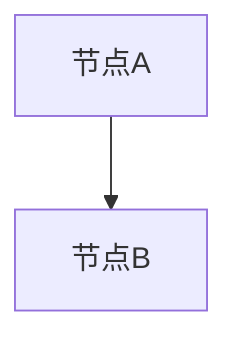

# 输入文档归一化

本 skill 负责在测试分析或测试设计正式开始前，把 Office 输入文档归一化为 Markdown。最终产物必须是一个 Markdown 输入事实源：正文文本、表格内容以及被判定为相关的图片/图形补充事实都合并在同一个 `.md` 文件中。它解决三个问题：

- 主流程只消费 Markdown，避免 `input-fact-modeling` 和设计依据补读重复处理 Office 文件。
- 转换结果按源文件内容哈希归档，源文件未变化时复用缓存，避免重复解析。
- 完整 run 在 `outputs/runs/<run-id>/inputs/` 下保存本次实际使用的归一化输入副本和 manifest，保证单次交付自包含可追踪。
- DOCX 中相关图片、流程图、架构图、状态图、截图或 EMF/Visio 图形被解析后，必须追加到同一个归一化 Markdown 中；不得只维护单独的图片补充文件、过程记录或 context-pack。

## 触发条件

当 `$ARGUMENTS`、用户消息或过程输入中出现以下文件时，先执行本 skill：

- 需求文档：`.docx`、`.xlsx`。
- 系统设计方案文档：`.docx`、`.xlsx`。
- 外部已评审测试分析方案：优先要求 `.md`；如果用户只给 Office 文件，也先归一化。

`.md` 文件不需要转换，直接作为下游输入。

## 归档路径

转换结果采用两层路径。

全局复用缓存固定写入仓库根目录下：

```text
outputs/input-cache/<sha256-12>/<source-stem>.md
outputs/input-cache/<sha256-12>/<source-stem>.conversion.json
```

- `<sha256-12>` 是源文件内容 SHA-256 的前 12 位。
- `<source-stem>` 来自源文件名，脚本会替换 Windows 非法路径字符。
- 源文件内容不变时，输出路径稳定，可直接复用。
- 源文件内容变化时，哈希变化，生成新的缓存目录，不覆盖旧转换结果。

完整测试分析或测试设计 run 创建后，还必须把本次使用的归一化输入绑定到 run 目录：

```text
outputs/runs/<run-id>/inputs/<sha256-12>-<source-stem>.md
outputs/runs/<run-id>/inputs/<sha256-12>-<source-stem>.conversion.json
outputs/runs/<run-id>/inputs/input-normalization-manifest.json
```

- run-local Markdown 是后续主流程读取的输入事实源；如果存在图片/图形补充，补充内容必须已经合并到该 Markdown 文件中。
- `input-normalization-manifest.json` 记录源文件、全局缓存、run-local 输入、metadata 和转换警告之间的映射。
- 独立 `/normalize-input-documents` 命令不创建 run 时，可以只写全局缓存。

## 执行命令

从仓库根目录执行：

```bash
python skills/normalize-input-documents/scripts/normalize-office-input.py "<input1.docx>" "<input2.xlsx>"
```

输出会使用中文列出每个输入的归一化结果。路径包含空格、中文或特殊字符时必须使用引号包裹。

完整测试分析或测试设计主流程必须在创建 run 目录后执行：

```bash
python skills/normalize-input-documents/scripts/normalize-office-input.py --run-dir outputs/runs/<run-id> "<input1.docx>" "<input2.xlsx>"
```

下游主流程必须使用 `outputs/runs/<run-id>/inputs/*.md` 路径作为需求文档、设计方案文档或外部分析方案路径。

如果需要机器可读结果：

```bash
python skills/normalize-input-documents/scripts/normalize-office-input.py --json --run-dir outputs/runs/<run-id> "<input1.docx>" "<input2.xlsx>"
```

## 复用规则

1. 对每个输入计算内容哈希。
2. 如果 `outputs/input-cache/<sha256-12>/<source-stem>.md` 和 `.conversion.json` 已存在，且未指定 `--force`，直接复用。
3. 如果不存在缓存，执行转换。
4. 如果传入 `--run-dir` 或 `--run-input-dir`，把归一化 Markdown 和 metadata 复制到 run-local inputs，并增量刷新 `input-normalization-manifest.json`。同一 run 多次执行归一化时，不得丢弃 manifest 中已有输入映射。
5. 转换后必须记录源路径、源大小、源 mtime、SHA-256、转换时间、输出 Markdown 路径和转换警告。

## 稳定执行要求

- 一次完整分析或设计 run 中，优先把需求、设计方案和外部分析方案等 Office 输入一次性传给脚本，减少上下文遗漏。
- 如果后续补充输入再次执行脚本，`input-normalization-manifest.json` 必须保留前序输入映射，并追加或更新本次输入映射。
- 脚本对用户可见的状态、错误和警告使用中文输出；JSON schema 字段名保持稳定，不因中文化改名。
- `.xlsx` 转换会裁剪每行尾部空单元格，避免 Excel 样式污染造成 Markdown 表格异常变宽。
- `.xlsx` 中的合并单元格会在 metadata warnings 中记录；复杂多级表头或测试因子库仍应按内置 Excel 参考做人工增强或项目知识归档。
- 若 `.docx` metadata 报告图片数量或图形风险，不得直接进入后续分析/设计并假设图中无信息；需要执行图片补充流程，并把相关图片/图形事实合并回归一化 Markdown 的原始图片占位位置；如果无法处理，必须在对应占位块和过程产物中记录未补充原因。

## 完成判定

执行本 skill 时，不能只运行 `python skills/normalize-input-documents/scripts/normalize-office-input.py ...` 后就结束。只有满足以下条件，才算本 skill 完成：

1. `$ARGUMENTS` 中所有 `.md`、`.docx`、`.xlsx` 输入都已识别并逐项给出处理状态。
2. 每个 Office 输入都有全局缓存 Markdown 和 `.conversion.json`；Markdown 输入明确标记为 `无需转换`。
3. 如果处于完整 run，`outputs/runs/<run-id>/inputs/input-normalization-manifest.json` 已存在，且包含本次所有输入映射；下游输入路径必须切换为 run-local Markdown。
4. 所有 metadata warnings 都已处理或记录收口状态：
   - `已处理`：例如已补充图片/图形事实并合并回归一化 Markdown、已人工确认复杂 Excel 表头、已增强测试因子库归档。
   - `无需处理`：例如图片仅为 logo、页眉页脚装饰图，或 Excel 合并单元格不影响可读性。
   - `未执行原因`：例如当前模型不支持多模态、缺少 LibreOffice 转图能力、用户只要求基础转换。
5. 如果 DOCX 存在图片、图形、EMF、Visio 或截图风险，必须读取 `references/docx-image-and-diagram-workflow.md`，并将相关图片补充事实合并回归一化 Markdown 的原始图片占位位置；无法处理时，也必须在对应占位块中写明未补充原因。
6. 如果 XLSX 存在合并单元格、多级表头、大型测试因子库或 checklist 风险，必须读取 `references/xlsx-to-markdown.md`；若它是项目知识源，还必须读取 `references/xlsx-to-ai-knowledge-base.md`，并说明基础表格转换是否足够。
7. 最终回复或过程产物必须包含“归一化完成摘要”，列出源文件、归一化 Markdown、metadata、run-local Markdown（如有）、缓存状态、warning 收口状态和下游应读取的路径。

如果任一项未满足，本 skill 的结论必须写 `未完成` 或 `需补充处理`，不得说“完成”。

## DOCX 转换边界

本仓库脚本提供稳定的文本与表格转换能力：

- 段落按原顺序输出。
- Word heading 样式映射为 Markdown 标题。
- 表格转换为 Markdown 表格。
- 多行单元格转换为 `<br>`。
- 表格中的 `|` 会转义。

如果 DOCX 中包含架构图、流程图、截图、EMF、Visio 或其他图片内容，脚本会在 metadata 中记录图片数量和转换警告，并尽量在 Markdown 中按原始图片位置插入 `DOCX_IMAGE_START` / `DOCX_IMAGE_END` 占位块。此时应按本 skill 内置参考 `references/docx-image-and-diagram-workflow.md` 补充图片描述或 Mermaid，并把补充内容替换到对应占位块所在位置，再进入分析/设计主流程；不得静默忽略设计图中承载的接口、流程、状态或依赖信息。

## 图片与图形合并规则

- 最终只交给下游一个 Markdown 输入事实源：`outputs/input-cache/<sha256-12>/<source-stem>.md`，或完整 run 中的 `outputs/runs/<run-id>/inputs/<sha256-12>-<source-stem>.md`。
- 独立命令未创建 run 时，图片/图形补充合并到全局缓存 Markdown 的原始图片占位位置。
- 完整 run 中，图片/图形补充必须合并到 run-local Markdown 的原始图片占位位置；如需复用全局缓存，也可以同步合并到全局缓存 Markdown，但下游只读取 run-local Markdown。
- 脚本生成的占位块形如：

````markdown
<!-- DOCX_IMAGE_START: image1.png#1 -->
图片占位：image1.png#1

- 来源：<docx 文件名> / image1.png
- 原文位置：原 DOCX 图片所在段落之后
- 补充状态：待处理
- 位置要求：解析后的 Mermaid 或结构化图片事实必须替换此占位块，不得移动到文末或单独文件。
<!-- DOCX_IMAGE_END: image1.png#1 -->
````

- 处理图片后，必须在同一位置替换为：

````markdown
<!-- DOCX_IMAGE_START: image1.png#1 -->
图片补充：image1.png#1



- 来源：<docx 文件名> / image1.png
- 补充状态：已处理
- 说明：<从图片可确认的接口、流程、状态或依赖>
<!-- DOCX_IMAGE_END: image1.png#1 -->
````

- 不适合转 Mermaid 的截图或图形，也必须在同一占位位置替换为结构化文字描述，列出可确认事实和不确定内容。
- 只有承载业务流程、接口、状态、依赖、异常分支、规则或测试相关信息的图片需要补充；logo、页眉页脚装饰图、无业务信息截图可写 `补充状态：无需处理`。
- 不得把 Mermaid 或图片事实只放在独立 `image-supplement.md`、reports、process、context-pack、文末补充章节或最终回复中；这些位置只能记录索引、状态和证据路径。
- 已存在同名图片占位块或补充块时应更新原块，不得重复追加导致同一图片出现多个版本。
- 如果脚本 metadata 显示存在未能定位到正文位置的图片，必须先人工定位并将补充内容放回正确上下文；无法确定位置时，归一化结论只能写 `需补充处理`，不能标记完成。

## 图片分批处理流程

DOCX 图片抽取和占位可以一次完成，但图片理解、Mermaid 转换和结构化事实补充必须分批处理，避免模型上下文超限。

推荐流程：

1. 运行 `python skills/normalize-input-documents/scripts/normalize-office-input.py ...`，生成 Markdown、metadata、图片占位块和 `image_processing` 队列。
2. 读取 `.conversion.json` 中的 `image_processing.queue` 与 `image_processing.recommended_batches`。
3. 先做轻量预筛选：
   - logo、页眉页脚、装饰图、纯图标：在对应占位块写 `补充状态：无需处理`。
   - 流程图、架构图、状态图、接口图、表格截图、业务截图：进入多模态处理队列。
4. 按原文顺序分批处理：
   - 普通图片每批最多 3-5 张。
   - 复杂流程图、架构图、状态图或信息密度高的截图每批 1-2 张。
   - 当前批次只读取该批图片、对应占位块上下文和必要的前后段落，不把所有图片内容放入同一轮上下文。
5. 每批处理完成后，立即替换对应 Markdown 占位块，并把该批图片状态更新为 `已处理`、`无需处理` 或 `未执行原因`。
6. 每批完成后重新读取当前 Markdown 或 metadata 状态，继续下一批；不要依赖模型记忆保存前一批结果。
7. 全部批次完成后，检查所有 `DOCX_IMAGE_START` 块内不得仍为 `补充状态：待处理`。如果仍有待处理、无法定位或未执行原因未写清，归一化结论为 `需补充处理`。

过程产物或最终回复可以记录批次状态摘要，但不得把批次分析结果作为独立事实源；事实源必须是原位回写后的 Markdown。

## XLSX 转换边界

本仓库脚本提供基础表格转换能力：

- 每个 sheet 输出为独立章节。
- 第一行非空行作为表头。
- 多行单元格转换为 `<br>`。
- 空行会跳过。

大型测试因子库、复杂多级表头或需要按维度拆分的 Excel，使用本 skill 内置参考 `references/xlsx-to-markdown.md` 和 `references/xlsx-to-ai-knowledge-base.md` 做增强处理。

## 内置参考资料

本 skill 已内置 Office 转 Markdown 所需参考，不依赖任何外部仓库或本机固定路径。

- `references/docx-image-and-diagram-workflow.md`：DOCX 图片、架构图、流程图、EMF、Visio 和截图的补充分析流程。
- `references/xlsx-to-markdown.md`：XLSX 多 sheet、多行单元格、管道符、多级表头、空行空列的 Markdown 转换规则。
- `references/xlsx-to-ai-knowledge-base.md`：测试设计因子库、checklist 或项目知识类 Excel 的结构化归档规则。

## 主流程集成

- `test-analysis-workflow` 和 `test-design-workflow` 必须先固定 `<run-id>` 并创建 run 目录，再执行本 skill。
- 若存在 Office 输入，主流程使用 `python skills/normalize-input-documents/scripts/normalize-office-input.py --run-dir outputs/runs/<run-id> ...`；无 Office 输入时该阶段置为 `skipped`。
- `process/task-list.md` 中的“输入文档归一化”阶段在触发时置为 `done`，证据路径写 `outputs/runs/<run-id>/inputs/input-normalization-manifest.json`；无 Office 输入时置为 `skipped`。
- `process/context-pack.md` 应记录源文件、全局缓存路径、run-local Markdown、metadata 和图片/图形补充合并状态，便于后续追踪源文件。
- 只有在“完成判定”全部满足后，`process/task-list.md` 才能把“输入文档归一化”阶段置为 `done`；仍有图片、图形、复杂 Excel 或 warning 未收口时，阶段状态应保持 `pending`、`blocked` 或记录 `需补充处理`。

## 约束

- 不从输入文件路径反推 `PROJECT_ROOT`；所有缓存路径从仓库根目录解析。
- 不把缓存 Markdown 写到输入文件所在目录。
- 完整 run 的后续流程不得直接读取全局 `outputs/input-cache/`；必须读取 `outputs/runs/<run-id>/inputs/` 下的 run-local 输入。
- 不把 Office 原文全量写入 memory、knowledge 或 rules。
- 不把转换警告写入测试分析或测试设计主交付件；需要留痕时写入归一化 Markdown 的对应图片占位块、process 或 reports。
- 转换后的 Markdown 是下游分析/设计的输入事实源；如果转换存在图片缺失或表格异常风险，必须在归一化 Markdown 或过程产物中记录，且下游不需要再读取单独图片补充文件才能理解输入。
