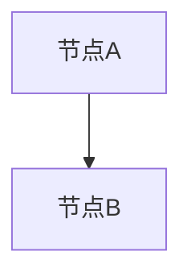

# DOCX 图片与图形补充流程

本文件是 `normalize-input-documents` 的内置参考，用于处理 `.docx` 中仅靠文本和表格抽取无法完整表达的信息。项目不依赖外部转换仓库或固定本机路径。

## 适用场景

当 `bin/normalize-office-input.py` 的 metadata 出现图片数量或转换警告时，进入本流程。

常见需要补充分析的内容包括：

- 架构图、流程图、时序图、状态图、部署图。
- EMF、Visio、Draw.io、截图或粘贴进 Word 的图片。
- 图片中承载接口、组件、状态流转、依赖关系、异常分支或业务规则。

页眉、页脚中的 logo、页码、装饰图通常不进入正文事实源；除非它们承载业务信息，只在过程记录中说明即可。

## 标准流程

1. 先运行输入归一化脚本，得到 Markdown 和 `.conversion.json`。

```bash
python bin/normalize-office-input.py <input.docx>
```

2. 查看 metadata 中的 `image_count` 和 `warnings`。如果图片可能承载设计事实，继续做图片补充。

3. 读取 `.conversion.json` 中的 `image_processing.queue` 和 `image_processing.recommended_batches`。如果没有该字段，将 `.docx` 作为 zip 包解压到临时目录，列出 `word/media/` 下的图片，并按 `DOCX_IMAGE_START` 占位块重建队列。

```python
import zipfile
from pathlib import Path

docx_path = Path(r"<input.docx>")
extract_dir = Path(r"<temp-docx-extract-dir>")
extract_dir.mkdir(parents=True, exist_ok=True)

with zipfile.ZipFile(docx_path, "r") as package:
    package.extractall(extract_dir)

media_dir = extract_dir / "word" / "media"
for image in sorted(media_dir.glob("*")):
    print(image.name, image.stat().st_size)
```

4. 如果存在 EMF/WMF 等不适合直接视觉分析的格式，优先用 LibreOffice headless 转为 PNG；如果转换结果空白或只剩文字，使用 `strings` 等方式提取可读文本并在过程产物中说明降级。

```bash
libreoffice --headless --convert-to png --outdir <media-dir> <media-dir>/image2.emf
```

5. 先做轻量预筛选，再分批做视觉分析。

预筛选规则：

- logo、页眉页脚、装饰图、纯图标：在对应 Markdown 占位块写 `补充状态：无需处理`。
- 流程图、架构图、时序图、状态图、接口图、表格截图、业务截图：进入多模态处理队列。
- 无法判断是否业务相关：进入处理队列，不凭经验跳过。

分批规则：

- 普通图片每批最多 3-5 张。
- 复杂流程图、架构图、状态图或信息密度高的截图每批 1-2 张。
- 当前批次只读取该批图片、对应占位块、图片前后少量正文和必要 metadata，不一次性读取全部图片。
- 每批完成后立刻替换 Markdown 中对应占位块，再进入下一批。

6. 对每批业务相关图片做视觉分析，判断类型并抽取事实。

推荐分析提示：

```text
请详细描述这张图片。判断它是架构图、流程图、时序图、状态图、接口图、UI截图、表格截图还是其他类型。
如果是图形，请列出所有节点、箭头、标签、条件、异常分支和依赖关系。
如果适合转 Mermaid，请给出 Mermaid；如果不适合，请给出可用于测试分析/测试设计的结构化文字描述。
```

7. 将当前批次补充结果合并回归一化 Markdown 中对应的 `DOCX_IMAGE_START` / `DOCX_IMAGE_END` 占位块。不要把 Mermaid 或图片事实只放在单独补充文件、过程记录、`process/context-pack.md` 或文末统一章节中；这些位置只能记录索引、状态和证据路径。

8. 当前批次完成后，重新检查本批占位块状态：

- `已处理`：已写入 Mermaid 或结构化事实。
- `无需处理`：已说明跳过原因，例如 logo、页眉页脚或装饰图。
- `未执行原因`：已说明当前模型或环境无法处理的原因。

9. 全部批次完成后，扫描归一化 Markdown。任何占位块仍为 `补充状态：待处理` 时，归一化不能标记完成。

## 图片插入位置识别

如果需要知道图片在正文中的上下文位置，可解析 `word/document.xml` 和 `word/_rels/document.xml.rels`。

默认情况下，`bin/normalize-office-input.py` 会尽量在 Markdown 中按原始图片位置插入占位块：

```markdown
<!-- DOCX_IMAGE_START: image1.png#1 -->
图片占位：image1.png#1

- 来源：<docx 文件名> / image1.png
- 原文位置：原 DOCX 图片所在段落之后
- 补充状态：待处理
- 位置要求：解析后的 Mermaid 或结构化图片事实必须替换此占位块，不得移动到文末或单独文件。
<!-- DOCX_IMAGE_END: image1.png#1 -->
```

图片补充必须替换对应占位块，确保流程图、架构图或截图事实停留在原文上下文位置。如果 metadata 显示有图片未能生成占位块，必须先人工定位该图的上下文；无法确定位置时，本次归一化只能标记为 `需补充处理`。

核心方法：

- 读取 `document.xml.rels`，建立 relationship id 到图片文件名的映射。
- 在 `document.xml` 中搜索 drawing/blip 的 embed id。
- 取 embed 前后若干 XML 片段，结合附近段落或表格判断图片位置。
- 页眉页脚图片从 `header*.xml.rels` 或 `footer*.xml.rels` 识别，默认不写入正文。

示例片段：

```python
import os
import re
import xml.etree.ElementTree as ET
from pathlib import Path

extract_dir = Path(r"<temp-docx-extract-dir>")
rels = extract_dir / "word" / "_rels" / "document.xml.rels"
doc_xml = extract_dir / "word" / "document.xml"

img_map = {}
rels_root = ET.parse(rels).getroot()
for rel in rels_root.findall(".//{http://schemas.openxmlformats.org/package/2006/relationships}Relationship"):
    if "image" in rel.get("Type", ""):
        img_map[rel.get("Id")] = os.path.basename(rel.get("Target", ""))

raw = doc_xml.read_text(encoding="utf-8", errors="ignore")
for match in re.finditer(r'embed="([^"]+)"', raw):
    embed_id = match.group(1)
    target = img_map.get(embed_id, embed_id)
    context = raw[max(0, match.start() - 500): match.end() + 500]
    print(target, context[:300])
```

## Markdown 补充格式

图片事实补充必须替换归一化 Markdown 中对应的图片占位块，供后续测试分析和测试设计读取。

图形适合 Mermaid 时：

````markdown
<!-- DOCX_IMAGE_START: image1.png#1 -->
图片补充：image1.png#1



- 来源：<docx 文件名> / <图片文件名>
- 补充状态：已处理
- 说明：<从图片可确认的接口、流程、状态或依赖>
<!-- DOCX_IMAGE_END: image1.png#1 -->
````

不适合 Mermaid 时：

```markdown
<!-- DOCX_IMAGE_START: image2.png#1 -->
图片补充：image2.png#1

- 图片类型：UI 截图 / 架构截图 / 表格截图 / 其他
- 来源：<docx 文件名> / <图片文件名>
- 补充状态：已处理 / 无需处理 / 未执行原因
- 可确认事实：<逐条列出>
- 不确定内容：<无法从图片确认的部分>
<!-- DOCX_IMAGE_END: image2.png#1 -->
```

位置要求：

- 不得把 Mermaid 图统一追加到 Markdown 文末。
- 不得只维护独立 `image-supplement.md`。
- 不得只在 `process/context-pack.md` 里登记图片事实。
- 不得删除 `DOCX_IMAGE_START` / `DOCX_IMAGE_END` 注释锚点；后续审查需要通过锚点确认每张图的处理状态。
- 如果图片在表格单元格中，脚本会尽量把占位块放在该表格之后并标明单元格位置；补充内容必须留在该占位块处，不要挪到其他章节。

## 批次状态摘要

可以在过程产物或最终回复中记录批次摘要，但摘要不是事实源：

```markdown
| 批次 | 图片 | 状态 | 说明 |
|---|---|---|---|
| IMG-BATCH-001 | image1.png#1, image2.png#1 | 已完成 | 已原位回写 Markdown |
| IMG-BATCH-002 | image3.png#1 | 需补充处理 | EMF 转 PNG 失败，需人工定位 |
```

批次摘要只用于恢复处理进度。下游测试分析和测试设计只能读取已经原位回写后的归一化 Markdown。

## 常见风险

- 只抽取 Word 段落会漏掉图片中的接口名、状态机、异常分支和组件依赖。
- EMF/WMF 转换可能空白；需要记录降级处理。
- 图片里的箭头方向、条件文字和异常返回不能凭经验补写，必须以视觉可见内容为依据。
- 截图类图片不一定适合 Mermaid，优先转成结构化描述。
- 大量图片应按批次分析，避免遗漏和上下文混乱。
- 每批结束必须立刻回写 Markdown，避免上下文压缩或中断导致前批分析结果丢失。
