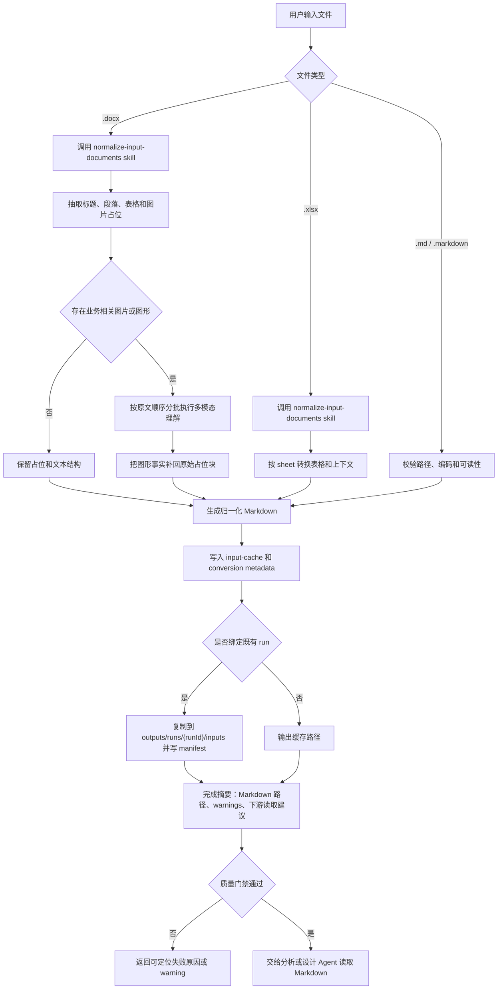

# File Normalization Agent 设计

`@file-normalization-agent` 是输入接入层 Agent，负责把用户提供的 `.docx`、`.xlsx` 和 `.md` 文档整理为后续测试分析、测试设计可稳定读取的 Markdown 输入事实源。它不承担测试分析或测试设计职责，而是把异构文档中的文本、表格、图片、流程图和结构化事实压缩到一个可追溯、可复用、可缓存的输入层。

## 设计目标

- 统一输入形态：下游只面对 Markdown，不直接解析 Office 文件。
- 保留原文语义：标题、段落、表格、图片占位、图形解析结果必须尽量保持原始顺序。
- 支持复用缓存：相同源文件按内容 hash 复用归一化结果，降低重复转换成本。
- 支持 run 绑定：当用户指定既有 run 时，把归一化输入副本写入该 run 的 `inputs/`，便于分析/设计链路稳定引用。
- 明确降级边界：无法解析的图片、图形、表格必须记录 warning，不用自然语言默默补全或编造事实。

## 职责边界

| 范围 | 设计说明 |
|---|---|
| 接收输入 | 识别 `.md` / `.markdown` / `.docx` / `.xlsx`，校验路径可访问性和扩展名。 |
| 文档转换 | 抽取 DOCX 段落、标题、表格、图片占位和 XLSX sheet 表格。 |
| 图片理解 | 对承载业务事实的截图、流程图、架构图、状态图、EMF/Visio 图形执行多模态补充。 |
| 缓存维护 | 将转换结果写入 `outputs/input-cache/<sha256-12>/`。 |
| run 绑定 | 可把归一化结果复制到 `outputs/runs/<run-id>/inputs/` 并写入 manifest。 |
| 下游交接 | 输出归一化完成摘要，明确下游应读取的 Markdown 路径与 warning 状态。 |

本 Agent 不生成 `SC-*`、`TP-*` 或 `TC-*`，不维护 `analysis-task-list` / `design-task-list`，不读取 project/personal 动态知识，也不执行 coverage 或 review。

## 输入与输出契约

### 输入

- 用户显式提供的一个或多个本地文件路径。
- 可选既有 run 路径或 run id，用于把输入副本绑定到当前分析/设计运行。
- 可选用户指令，例如跳过图片理解、只归一化指定文件等。

### 输出

| 类型 | 默认路径 | 用途 |
|---|---|---|
| 归一化 Markdown | `outputs/input-cache/<sha256-12>/<source-stem>.md` | 下游分析/设计读取的主输入事实源。 |
| 转换元数据 | `outputs/input-cache/<sha256-12>/<source-stem>.conversion.json` | 记录源文件、hash、转换状态、warning 和复用信息。 |
| run-local 副本 | `outputs/runs/<run-id>/inputs/<source-stem>.md` | 让指定 run 内部引用稳定、可迁移。 |
| 输入 manifest | `outputs/runs/<run-id>/inputs/input-normalization-manifest.json` | 汇总多个输入文件与缓存来源之间的映射。 |

Markdown 是下游可读事实源；conversion metadata 和 manifest 是可追溯索引，不作为测试分析或测试设计的业务事实补充来源。

## 整体处理流程

流程上，Agent 门面只负责识别意图和路由；具体转换规则由 `skills/normalize-input-documents/SKILL.md` 承载。DOCX 图片补充属于归一化阶段内部能力，不把图片理解结果作为单独知识源散落到下游。

## 核心处理模型

### Markdown 输入

`.md` / `.markdown` 不做内容重写，只进行路径、编码和可读性校验。输出可以直接指向原文件，也可以在绑定 run 时复制到 `inputs/`。该路径适用于用户已经完成手工整理或由其他工具提前归一化的输入。

### DOCX 输入

DOCX 转换分为结构抽取和视觉补充两层：

1. 结构抽取保留标题层级、段落顺序、表格内容和图片占位。
2. 图片、流程图、架构图、状态图、截图和 EMF/Visio 图形如果承载业务事实，必须把理解结果补回对应 `DOCX_IMAGE_START` / `DOCX_IMAGE_END` 占位块中。
3. 图片补充必须按原文顺序分批执行，普通图片每批最多 3-5 张，复杂图每批 1-2 张，避免上下文过载导致漏图或错位。

### XLSX 输入

XLSX 转换以 sheet 为基本单元，优先保留表头、合并单元格语义、空行分隔和表格上下文。对于测试因子库、checklist、配置矩阵等复杂表格，Agent 只负责把可见结构转换为 Markdown，不把它直接解释为最终测试点或测试用例。

## 多模态与降级策略

OpenCode 独立归一化命令默认按 vision-enabled 处理。Agent 不应因为无法确认模型名称就写“不支持多模态解析”。只有出现以下事实时，才记录图片未执行或部分执行的标准原因：

- 源图片不可访问或提取失败。
- 图片格式不可读或转换工具缺失。
- 用户明确要求跳过图片理解。
- 当前执行平台明确声明视觉能力不可用。
- 图片内容与业务事实无关，仅为装饰性截图或重复图。

降级记录必须写入 conversion metadata 和最终摘要；不得把无法确认的图片内容编造成业务规则、字段、状态或流程。

## 稳定性设计

- 缓存以源文件 hash 为主键，文件名变化但内容相同时可复用转换结果。
- 图片理解采用小批量顺序处理，避免一次性把完整 DOCX 图片上下文交给模型。
- 下游只读取 Markdown 路径，不读取临时 Office 中间件。
- 归一化输出只写缓存目录或指定 run 的 `inputs/`，不写分析/设计过程件。
- 转换失败时返回可定位的失败原因和已完成部分，不让分析/设计 Agent 继续读取半成品。

## 质量门禁

完成归一化时至少确认：

- 输出 Markdown 文件存在且非空。
- DOCX 图片占位和补充内容顺序一致。
- 表格没有被压成不可读的单行文本。
- conversion metadata 中记录源路径、hash、输出路径、转换状态和 warnings。
- 绑定 run 时，manifest 中记录缓存路径与 run-local 路径的映射。

## 运行事实源

具体执行步骤以 `skills/normalize-input-documents/SKILL.md` 为准；DOCX 图片处理以 `skills/normalize-input-documents/references/docx-image-and-diagram-workflow.md` 为准。本文档只描述系统设计，不替代 runtime skill、脚本或 AGENTS 规则。
