# Test Analysis Agent 设计

`@test-analysis-agent` 是“需求到测试分析方案”的主 Agent，回答 what to test。它基于已归一化 Markdown 需求文档、可选设计方案、强制 rules、project/personal 动态来源，生成 `SC -> TP` 粒度的测试分析方案。它不生成测试用例，不输出步骤、测试数据或预期结果。

## 设计目标

- 把需求事实组织为可评审的业务场景树 `SC-*`。
- 在叶子场景下识别验证目标、规则点、路径点、状态点、权限点、接口契约点和风险点 `TP-*`。
- 通过冻结 SC 树和分片生成 TP，降低大文档、大场景下模型一次性生成的不稳定性。
- 用固定脚本处理结构、编号、合并、Markdown 渲染和一致性检查，让模型只负责语义判断。
- 通过 review、coverage 和 final report 建立从输入事实到测试点的可追溯闭环。

## 职责边界

| 范围 | 设计说明 |
|---|---|
| 输入校验 | 只接受 Markdown 需求/设计输入；Office 输入必须先由归一化 Agent 处理。 |
| 上下文准备 | 构建 rules-pack、context-pack 和 input-fact-model。 |
| 测试方法路由 | 基于输入事实选择适用的测试技术参考。 |
| 场景建模 | 生成并评审冻结 `process/scenario-tree.json`。 |
| 测试点生成 | 按叶子 SC 生成 `process/test-point-slices/<SC-ID>.json`。 |
| 交付合并 | 由固定脚本合并为 `deliverables/test-analysis-solution.json` 并统一 `TP-*` 编号。 |
| 收口审查 | 执行最终语义 review、fact coverage、coverage-review 和 final-report。 |

本 Agent 不创建 `TC-*`，不编写测试步骤，不手工维护派生 Markdown，不通过临时脚本处理 JSON。

## 输入与输出契约

### 输入

- 至少一份已归一化需求 Markdown。
- 可选一份或多份已归一化设计方案 Markdown。
- 可选 `project-key`，用于 rules 和 knowledge 的 project 层绑定。
- 根目录 `rules/`、`knowledge/` 中对当前阶段可见的上下文。

### 输出

| 类型 | 路径 | 说明 |
|---|---|---|
| 主交付 JSON | `outputs/runs/<run-id>/deliverables/test-analysis-solution.json` | 测试分析事实源。 |
| 主交付 Markdown | `outputs/runs/<run-id>/deliverables/test-analysis-solution.md` | 由脚本渲染的人读版。 |
| 任务清单 | `process/analysis-task-list.json/.md` | 分析阶段状态跟踪。 |
| 场景树 | `process/scenario-tree.json` | 已评审冻结的 SC 层级。 |
| TP 工作项 | `process/test-point-work-items.json` | 叶子 SC 级分片计划。 |
| TP 切片 | `process/test-point-slices/<SC-ID>.json` | 当前 SC 下的 TP 语义内容。 |
| Review | `process/reviews/*.json` | SC、TP 切片和最终方案语义评审。 |
| Coverage | `process/analysis-fact-coverage-map.json`、`process/reviews/analysis-coverage-review.json` | 输入事实到 SC/TP 的覆盖收口。 |
| Final report | `reports/analysis-final-report.json/.md` | 人审报告，不触发返工。 |

## 核心领域模型

### SC 场景树

`SC-*` 表示业务场景树，最多 3 层。非叶子 SC 只承载分组语义，叶子 SC 承载测试点。SC 树一旦通过 review 冻结，TP 阶段不得新增、删除、合并或改写 SC。

### TP 测试点

`TP-*` 表示叶子场景下的验证目标，编号在 run 内全局唯一且增量稳定。TP 应覆盖业务规则、流程路径、状态迁移、权限角色、接口契约、数据一致性、配置组合、异常和风险。每个叶子 SC 必须包含独立的 `E2E场景测试` 测试点，用于覆盖主业务流闭环。

### Basis 引用

`basisRefs[]` 用于追溯需求、设计、rules 或动态来源依据。它不是全文引用容器，只记录足以支持当前 SC/TP 的来源线索。缺少依据时，Agent 不能编造业务事实，应在 review 或 coverage 中暴露缺口。

## 执行编排

```mermaid
flowchart TD
    A["用户请求生成测试分析方案"] --> B["test-analysis-agent 门面识别意图"]
    B --> C{"输入是否全为 Markdown"}
    C -->|"否，包含 Office 文件"| C1["阻断并路由到 file-normalization-agent"]
    C -->|"是"| D["调用 test-analysis-workflow skill"]
    D --> E["manage-run prepare 创建或复用持久 run"]
    E --> F["update-run-task 初始化 analysis-task-list"]
    F --> G["build-rules-pack 生成 rules-pack"]
    G --> H["context-source-indexing 生成 context-pack"]
    H --> I["input-fact-modeling 生成 input-fact-model"]
    I --> J["testing-method-router 选择测试技术参考"]
    J --> K["init-scenario-tree 初始化 scenario-tree"]
    K --> L["test-analysis-solution-generation 填写 SC 树"]
    L --> M["lint-scenario-tree 结构校验"]
    M --> N["test-analysis-solution-review 评审 SC 树"]
    N --> O{"SC review 是否通过"}
    O -->|"否"| L
    O -->|"是，冻结 SC"| P["extract-test-point-work-items 生成 TP 工作项"]
    P --> Q["init-staged-slices 初始化 test-point-slices"]
    Q --> R["逐叶子 SC 调用 generation 填写 TP 切片"]
    R --> S["逐切片调用 review 评审 TP"]
    S --> T{"切片 review 是否通过"}
    T -->|"否"| R
    T -->|"是"| U["merge-staged-slices 合并分析主交付"]
    U --> V["lint-run-json 确定性 JSON 校验"]
    V --> W["render-run-markdown 渲染 Markdown"]
    W --> X["lint-test-analysis-solution 校验 Markdown"]
    X --> Y["最终 test-analysis-solution-review"]
    Y --> Z["build-fact-coverage-map 生成覆盖图"]
    Z --> AA["coverage-review 覆盖收口"]
    AA --> AB{"review 或 coverage 是否阻断"}
    AB -->|"是"| AC["apply-review-findings / apply-coverage-gaps 重开对应 TP 切片"]
    AC --> R
    AB -->|"否"| AD["build-final-report 生成 analysis-final-report"]
    AD --> AE["check-staged-run --scope analysis"]
    AE --> AF["输出 test-analysis-solution.json/.md 和报告"]
```

关键设计是“先冻结 SC，再分片生成 TP”。SC 决定业务结构，TP 决定验证目标；拆开后可以避免模型在大输入中同时处理场景组织和测试点枚举导致漏项、重复或结构漂移。

上图中的模型生成点只有 SC 树和 TP 切片；目录创建、工作项初始化、合并、编号、Markdown 渲染、lint 和返工定位都由固定脚本处理。这样可以把不稳定的语义生成限制在小范围 JSON 中，把可确定的结构约束交给脚本。

## 稳定性机制

- 用户可用 `runid=<requirement-id>` 复用持久 run；未提供时由 `bin/manage-run.py` 调用 `bin/generate-run-id.py` 生成时间戳。所有产物写入 `outputs/runs/<run-id>/`。
- rules-pack 和 context-pack 只做索引；后续阶段按阶段可见性读取正文并判断是否应用。
- `generationContext` 由固定脚本构建，只作为当前阶段工作包，不合并为主交付业务事实。
- TP 按叶子 SC 切片生成，单个模型上下文只处理一个场景下的测试点。
- 合并与编号由 `bin/merge-staged-slices.py --scope analysis` 负责，避免手工编号漂移。
- review 或 coverage 发现问题时，必须回到对应 TP 切片返工，再重新合并、校验和收口。

## 质量门禁

分析方案完成前必须满足：

- `scenario-tree.json` 通过结构 lint 和语义 review。
- 每个叶子 SC 都有对应 TP 切片，且切片 review 通过。
- `deliverables/test-analysis-solution.json` 只包含 schema 2.0 允许字段。
- 不出现测试用例、测试数据、测试步骤或预期结果。
- `TP-*` 保留既有编号，新 TP 追加编号且退役编号不复用；每个叶子 SC 包含 `E2E场景测试`。
- `bin/lint-run-json.py`、Markdown render、分析方案 Markdown lint 通过。
- 最终 `test-analysis-solution-review`、`analysis-coverage-review` 和 `check-staged-run --scope analysis` 通过或已完成返工闭环。

## 异常处理

- 输入包含 Office 文件：不创建分析 run，提示先使用归一化 Agent。
- project-key 未绑定：不得读取所有 project 目录正文，只记录未扫描原因。
- SC review 阻断：只修 `scenario-tree.json`，不得绕过冻结直接生成 TP。
- TP review 或 coverage 阻断：运行返工脚本重开工作项，修复对应 `test-point-slices/<SC-ID>.json`。
- Markdown 渲染失败：修 JSON 事实源，不手工编辑 Markdown。

## 运行事实源

完整执行契约以 `skills/test-analysis-workflow/SKILL.md` 为准。测试分析生成规则以 `skills/test-analysis-solution-generation/SKILL.md` 为准，语义评审以 `skills/test-analysis-solution-review/SKILL.md` 为准，覆盖收口以 `skills/coverage-review/SKILL.md` 为准。
