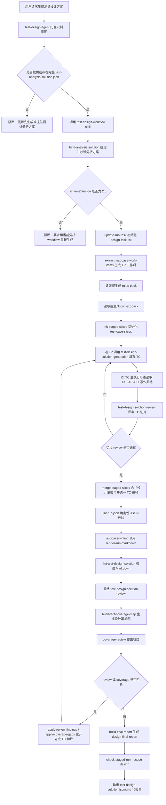

# Test Design Agent 设计

`@test-design-agent` 是“测试分析方案到测试设计方案”的主 Agent，回答 how to test。它承接已评审的 `test-analysis-solution.json`，继承其中冻结的 `SC-*` 场景树和 `TP-*` 测试点，在每个 TP 下生成可执行、可评审、可渲染的 `TC-*` 测试用例。

## 设计目标

- 严格复用分析方案，不在设计阶段重新发明或改写 SC/TP。
- 以 TP 为最小生成单元，避免大 JSON 导致模型卡住、漏项或临时生成脚本。
- 让模型只负责当前 TP 下的测试用例语义，结构、合并、编号和渲染交给固定脚本。
- 按公共写作规范和 GUI/API/CLI 风格规范生成可执行测试步骤。
- 通过 review、coverage 和 final report 建立从 FACT、SC、TP 到 TC 的追踪闭环。

## 职责边界

| 范围 | 设计说明 |
|---|---|
| 分析方案绑定 | 显式绑定或复用完整 `test-analysis-solution.json`。 |
| 设计工作项提取 | 从所有叶子 SC 的 TP 中生成 `process/test-case-work-items.json`。 |
| 上下文补读 | 读取当前阶段适用 rules、动态来源、需求和设计依据。 |
| TC 切片生成 | 按 `TP-*` 填写 `process/test-case-slices/<TP-ID>.json`。 |
| 切片评审 | 对每个 TP 下的 TC 执行语义、可执行性和依据评审。 |
| 合并交付 | 由固定脚本合并为 `deliverables/test-design-solution.json` 并统一 `TC-*` 编号。 |
| Markdown 写作 | 由 `test-case-writing` 调用渲染脚本生成 Markdown。 |
| 收口审查 | 执行最终设计 review、fact coverage、coverage-review 和 final-report。 |

本 Agent 不自动调用分析 workflow，不接受碎片化 TP 作为主入口，不直接编辑派生 Markdown，不临时生成脚本处理 JSON。

## 输入与输出契约

### 输入

- 必需：完整、符合 schema 2.0 的 `test-analysis-solution.json`。
- 可选：原始需求 Markdown、设计方案 Markdown、project-key。
- 可选：rules、knowledge 中对设计阶段可见的上下文来源。

如果用户只提供需求或设计方案并要求生成测试设计，Agent 必须失败并说明需要先取得完整测试分析方案。设计阶段不隐式启动分析阶段。

### 输出

| 类型 | 路径 | 说明 |
|---|---|---|
| 主交付 JSON | `outputs/runs/<run-id>/deliverables/test-design-solution.json` | 测试设计事实源。 |
| 主交付 Markdown | `outputs/runs/<run-id>/deliverables/test-design-solution.md` | 由脚本渲染的人读版。 |
| 任务清单 | `process/design-task-list.json/.md` | 设计阶段状态跟踪。 |
| TC 工作项 | `process/test-case-work-items.json` | 所有 TP 的设计切片计划。 |
| TC 切片 | `process/test-case-slices/<TP-ID>.json` | 单个 TP 下的测试用例语义内容。 |
| Review | `process/reviews/*.json` | TC 切片和最终设计方案语义评审。 |
| Coverage | `process/design-fact-coverage-map.json`、`process/reviews/design-coverage-review.json` | FACT 到 SC/TP/TC 的覆盖收口。 |
| Final report | `reports/design-final-report.json/.md` | 人审报告，不触发返工。 |

## 核心领域模型

### SC/TP 继承

设计方案中的 SC 和 TP 必须来自分析方案。设计阶段不得新增、删除、合并或改写分析层级。若发现分析层级缺失，应通过 review 或 coverage 暴露问题，不能在设计交付件中私自修补。

### TC 测试用例

`TC-*` 是可独立执行、独立判定的测试实例，编号在 run 内全局唯一且增量稳定。每个 TC 必须包含：

- `id`
- `title`
- `level`，取值为 `Level 0` 到 `Level 4`
- `preconditions[]`
- `testData[]`，每项包含 `name`、`value`、`description`
- `steps[]`，每项包含 `stepNo`、`action`、`expected`
- `expectedResult`
- `sourceRefs[]`

TC 的原子性是核心质量要求。不同输入条件、等价类、边界点、角色、权限、状态、配置、外部依赖返回、消息顺序、异常类型或接口参数变体，必须拆成独立 TC。

### 测试步骤表达

`steps[].action` 只写用户、测试人员、外部调用方或测试工具可执行的动作或取数动作；系统内部判断、状态变化、响应内容和断言写入 `steps[].expected`。例如“MM 系统判断 count=0 后取消交易”不能作为 action，应改为测试人员发起触发该分支的请求或界面操作，并在 expected 中检查交易取消结果。

## 执行编排

设计阶段的核心稳定性策略是“按 TP 切片”。每次只让模型处理一个冻结 TP 的 TC 集合，避免读取和改写完整 `test-design-solution.json`，也避免模型为了处理大 JSON 临时生成 Python、JS 或 PowerShell 脚本。

上图中的模型生成点只在单个 `test-case-slices/<TP-ID>.json` 内发生。分析方案绑定、工作项提取、切片初始化、合并、编号、Markdown 渲染和返工定位都由固定脚本完成，确保大规模测试设计不会退化为模型直接读写完整大 JSON。

## 写作规范集成

测试设计 JSON 是 Markdown 的事实源，因此写作规范必须在生成 JSON 时生效，而不是 Markdown 渲染后再修饰。

- 公共写作标准：`knowledge/test-case-writing-standard.md`
- GUI 风格：`knowledge/test-case-writing-styles/gui-test-case-style.md`
- API 风格：`knowledge/test-case-writing-styles/api-test-case-style.md`
- CLI 风格：`knowledge/test-case-writing-styles/cli-test-case-style.md`

生成每个 TC 前，Agent 必须根据测试人员实际发起动作判断主执行形态。GUI 用例强调菜单路径、页面、控件可见文本和可观察结果；API 用例强调 `接口=METHOD /path`、Header、Query、Body、响应字段和副作用；CLI 用例强调主机/容器、工作目录、命令、退出码和 stdout/stderr。

## 稳定性机制

- 设计 workflow 必须先绑定完整分析方案，缺失时阻断。
- 每个 TP 都生成独立 `test-case-slices/<TP-ID>.json`，模型只编辑当前切片的 `testPoint.testCases[]`。
- `generationContext` 只作为当前切片工作包，不合并为最终业务事实。
- 合并与 `TC-*` 全局编号由 `bin/merge-staged-slices.py --scope design` 负责。
- 主交付 Markdown 由 `bin/render-run-markdown.py` 渲染，不手工维护。
- 切片 review、最终 review 或 coverage 发现问题时，必须回到对应 TC 切片修复。
- 固定脚本能力不足时修改仓库 `bin/` 或 skill `scripts/`，不得在 run 目录生成临时可执行脚本。

## 质量门禁

设计方案完成前必须满足：

- 输入分析方案符合 schema 2.0，且 SC/TP 结构完整。
- 每个 TP 至少有 1 个 TC，但覆盖充分性不能只靠数量判断。
- TC 字段完整，`testData[]`、`steps[]`、`sourceRefs[]` 格式符合 schema。
- action 是可执行动作，expected 承载检查点和系统可观察结果。
- GUI/API/CLI 风格与当前 TC 主执行形态一致。
- `TC-*` 保留既有编号，新 TC 追加编号且退役编号不复用。
- `bin/lint-run-json.py`、Markdown render、测试设计 Markdown lint 通过。
- 最终 `test-design-solution-review`、`design-coverage-review` 和 `check-staged-run --scope design` 通过或已完成返工闭环。

## 异常处理

- 缺少分析方案：阻断并提示先生成或提供 `test-analysis-solution.json`。
- 旧 schema 输入：阻断并建议用当前分析 workflow 重新生成。
- TC 切片 review 阻断：重开对应 `TP-ID` 工作项，修复 `test-case-slices/<TP-ID>.json`。
- coverage 发现缺口：通过 `apply-coverage-gaps` 定位切片返工，不直接编辑主交付件。
- Markdown 渲染异常：修 canonical JSON 后重新渲染。

## 运行事实源

完整执行契约以 `skills/test-design-workflow/SKILL.md` 为准。测试设计生成规则以 `skills/test-design-solution-generation/SKILL.md` 为准，设计语义评审以 `skills/test-design-solution-review/SKILL.md` 为准，Markdown 写作以 `skills/test-case-writing/SKILL.md` 为准。
