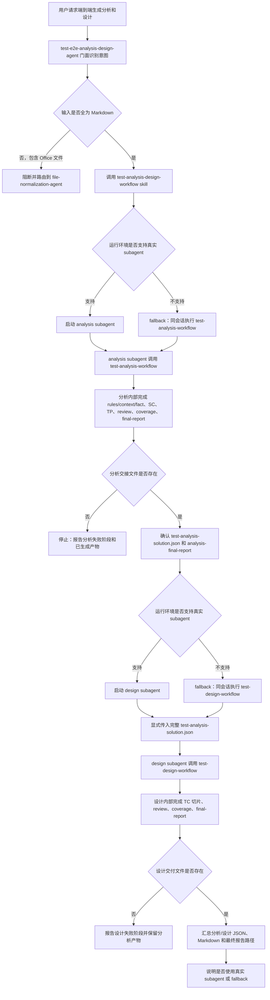

# E2E Analysis Design Agent 设计

`@test-e2e-analysis-design-agent` 是端到端编排 Agent，面向用户“一次性完成测试分析和测试设计”的请求。它不重新实现分析或设计逻辑，而是把 `test-analysis-agent` 和 `test-design-agent` 作为两个阶段进行隔离编排，并通过 canonical JSON 完成阶段交接。

## 设计目标

- 为用户提供从需求输入到分析方案、设计方案和最终报告的一站式入口。
- 让分析阶段和设计阶段尽量在独立执行上下文中运行，降低聊天上下文污染。
- 阶段之间只通过文件系统中的正式产物交接，不通过自然语言总结传递业务事实。
- 复用 analysis/design workflow 的完整质量门禁，不在 e2e 层重复维护规则。
- 在任一阶段失败时保留已完成产物，并给出可定位的失败阶段和路径。

## 职责边界

| 范围 | 设计说明 |
|---|---|
| 输入路由 | 校验用户输入是否为 Markdown；Office 输入交给归一化 Agent。 |
| 分析编排 | 启动 analysis subagent 执行 `test-analysis-workflow`。 |
| 交接校验 | 确认分析交付件和 analysis final report 存在。 |
| 设计编排 | 启动 design subagent，显式传入完整 `test-analysis-solution.json`。 |
| 输出汇总 | 汇总分析/设计 JSON、Markdown 和 final report 路径。 |
| fallback 说明 | 不支持真实 subagent 时，说明使用同会话串联执行。 |

本 Agent 不直接生成 SC、TP 或 TC，不直接编辑主交付件 JSON，不重复执行 analysis/design 内部 lint、review、coverage 或 final-report 逻辑。

## 输入与输出契约

### 输入

- 至少一份已归一化需求 Markdown。
- 可选一份或多份已归一化设计方案 Markdown。
- 可选 `project-key`，必须原样传递给分析和设计阶段。

如果输入包含 `.docx` 或 `.xlsx`，e2e Agent 必须阻断并路由到 `@file-normalization-agent`，不在端到端流程中直接转换 Office 文件。

### 输出

| 类型 | 路径 |
|---|---|
| 测试分析 JSON | `outputs/runs/<run-id>/deliverables/test-analysis-solution.json` |
| 测试分析 Markdown | `outputs/runs/<run-id>/deliverables/test-analysis-solution.md` |
| 测试设计 JSON | `outputs/runs/<run-id>/deliverables/test-design-solution.json` |
| 测试设计 Markdown | `outputs/runs/<run-id>/deliverables/test-design-solution.md` |
| 分析最终报告 | `outputs/runs/<run-id>/reports/analysis-final-report.md` |
| 设计最终报告 | `outputs/runs/<run-id>/reports/design-final-report.md` |

同一端到端流程优先复用分析阶段创建的 run 目录，让分析和设计产物位于同一 `outputs/runs/<run-id>/` 下。

## 编排模型

端到端流程采用两阶段流水线：

analysis subagent 负责完整分析内部闭环，包括 rules/context/fact、SC 树、TP Markdown 切片、结果固化、review、coverage 和 analysis final report。design subagent 只在分析交付成功后启动，显式读取完整分析 JSON，并负责 TC Markdown 切片、结果固化、写作、review、coverage 和 design final report。

## 阶段交接设计

阶段交接只允许依赖以下事实：

- 同一 run 目录。
- `deliverables/test-analysis-solution.json`。
- 原始归一化 Markdown 输入路径。
- 可选 project-key。
- analysis final report 是否存在。

不得把 analysis subagent 的聊天总结、临时计划、未落盘推理、局部 TP 草稿或人工口头描述作为 design 阶段的业务事实。这样设计的目的，是让端到端流程可复跑、可审计，也让设计阶段不会被分析阶段的上下文噪声带偏。

## Subagent 隔离与 fallback

优先使用真实独立 subagent 执行分析和设计阶段。这里的“独立”指独立会话上下文，而不是独立文件系统。两个阶段仍写入同一 run 目录，通过文件交接。

如果当前运行环境不支持真实 subagent，可以 fallback 为同一会话内串联执行 `test-analysis-workflow` 和 `test-design-workflow`。fallback 时必须满足：

- 仍通过 `test-analysis-solution.json` 显式交接。
- 不把分析阶段自然语言总结当作设计事实。
- 最终回复说明未获得 analysis/design 会话隔离收益。

## 质量门禁

e2e 层只做轻量交接和路径检查，不复制子 workflow 门禁：

- 分析阶段完成后，检查分析 JSON 和 analysis final report 存在。
- 分析阶段失败时，不进入设计阶段。
- 设计阶段启动时，必须显式传入分析 JSON 路径。
- 设计阶段完成后，检查设计 JSON、设计 Markdown 和 design final report 存在。
- 最终回复汇总 run 目录、关键交付件路径、分析/设计收口状态和是否使用真实 subagent。

具体的 JSON lint、Markdown render、review、coverage、check-staged-run 由 analysis/design workflow 自己保证。

## 异常处理

- Office 输入：阻断并提示先归一化，不创建 e2e run。
- 分析阶段失败：停止流程，报告分析失败位置和已生成产物。
- 分析交接文件缺失：不启动设计阶段，提示缺失路径。
- 设计阶段失败：保留分析产物，报告设计失败位置和待修复切片或门禁。
- fallback 执行：最终明确说明执行环境未提供真实 subagent 隔离。

## 运行事实源

完整编排契约以 `skills/test-analysis-design-workflow/SKILL.md` 和 `agents/test-e2e-analysis-design-agent.md` 为准。分析阶段以 `skills/test-analysis-workflow/SKILL.md` 为准，设计阶段以 `skills/test-design-workflow/SKILL.md` 为准。
