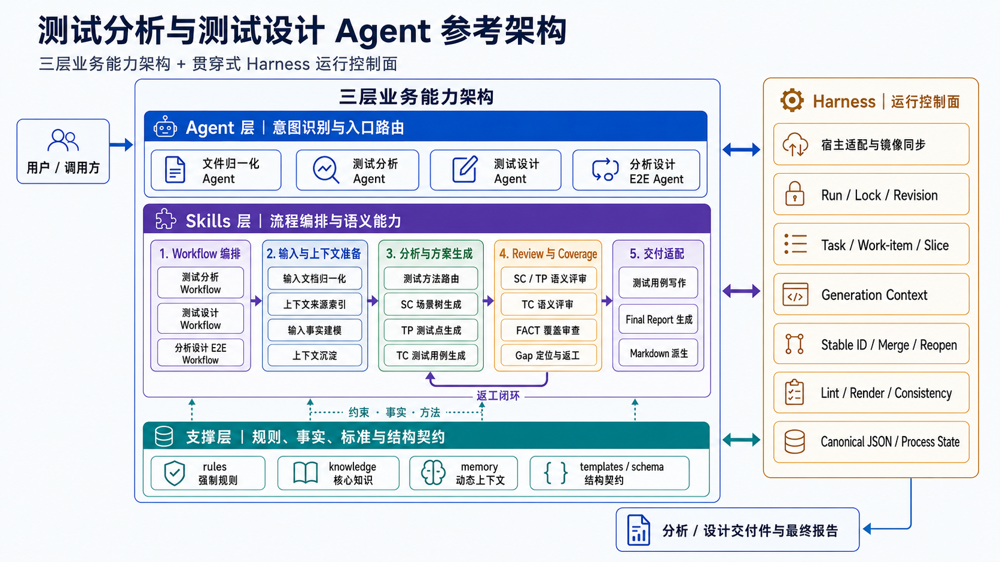
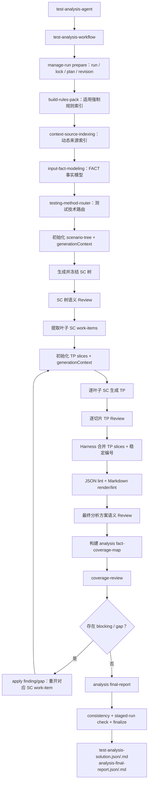
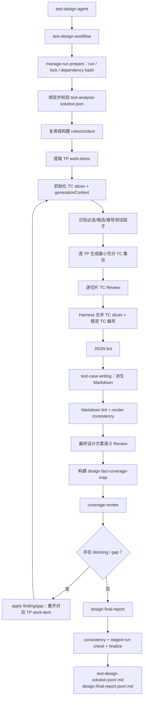

# 测试分析与测试设计 Agent 参考架构

本文从工程职责出发，说明测试分析与测试设计 Agent 包的参考架构。主体采用 **Agent 层、Skills 层、支撑层** 三层划分；Harness 不作为第四个业务层，而是位于右侧、贯穿三层的运行控制面。

本文用于帮助维护者理解模块边界和完整处理链路。具体执行顺序仍以 `AGENTS.md`、`agents/`、`skills/`、`templates/` 和 `bin/` 为准。

## 1. 架构划分原则

三层主架构分别回答三个问题：

| 层次 | 回答的问题 | 核心职责 |
|---|---|---|
| Agent 层 | 用户想做什么，应该进入哪个能力入口？ | 意图识别、入口路由、参数传递、职责边界、端到端阶段调度 |
| Skills 层 | 这项任务应该按什么流程、使用什么方法完成？ | Workflow 编排、上下文准备、分析与生成、语义评审、覆盖收口、表达适配 |
| 支撑层 | 执行时依据哪些规则、事实、标准和模板？ | 强制规则、核心知识、动态上下文、结构契约 |

Harness 回答另一个维度的问题：

> 如何让以上三层在不同宿主中，以可重复、可恢复、可追踪、可校验的方式运行？

因此，Harness 与三层不是同一分类维度。三层描述业务能力和依赖关系，Harness 描述执行这些能力所需的工程机制。某个 Skill 可以调用 Harness，也可以带有自己的局部脚本，但不因此变成 Harness。

建议使用以下判断标准：

- 需要理解用户意图和选择入口的内容放在 Agent 层。
- 需要模型进行业务判断，或者需要定义语义流程顺序的内容放在 Skills 层。
- 规则、标准、知识、历史上下文和结构模板放在支撑层。
- run、锁、revision、工作项、稳定编号、结构初始化、机械合并、渲染和确定性校验归入 Harness。

## 2. 总体架构图



图中的双向关系表示：

- Agent 和 Workflow 发起执行请求，Harness 提供宿主入口、run 状态和阶段运行环境。
- Harness 为 Skill 初始化工作包和结构，Skill 填充需要语义判断的内容，Harness 再执行合并、编号和校验。
- 支撑层向 Skills 提供规则与知识，也向 Harness 提供模板、schema 和可机器检查的结构契约。
- Review 或 coverage 发现问题后，语义判断由 Skill 完成，工作项定位与重开由 Harness 完成，返工再回到对应生成 Skill。

## 3. Agent 层

Agent 层是面向用户的能力门面，应保持轻量。它负责理解请求、选择正确 Workflow、传递路径和 run 参数，并阻止跨越职责边界的隐式行为。

| Agent | 用户意图 | 路由目标 | 边界 |
|---|---|---|---|
| `file-normalization-agent` | 将 `.docx`、`.xlsx` 或外部 Markdown 整理为下游可读输入 | `normalize-input-documents` | 不执行测试分析或测试设计 |
| `test-analysis-agent` | 基于需求和可选设计生成 `SC -> TP` | `test-analysis-workflow` | 不生成 TC，不复制 Workflow 内部步骤 |
| `test-design-agent` | 基于完整、已评审分析方案生成 `SC -> TP -> TC` | `test-design-workflow` | 缺少分析 JSON 时不自动补跑分析 |
| `test-e2e-analysis-design-agent` | 一次性完成测试分析和测试设计 | `test-analysis-design-workflow` | 只负责阶段调度与文件交接，不复制两个阶段内部逻辑 |

Agent 门面的典型动作包括：

1. 判断用户是在做输入归一化、测试分析、测试设计还是端到端生成。
2. 确认输入格式和上游产物是否满足对应 Workflow 的前置条件。
3. 原样传递 `runid`、`mode`、`project-key`、输入路径和 `remove-source` 等参数。
4. 在 E2E 请求中优先把 analysis 和 design 放入独立 subagent，并通过 canonical JSON 显式交接。
5. 最终向用户汇总交付件路径、报告路径以及是否使用了 fallback。

Agent 层不维护详细命令清单，不直接决定 SC/TP/TC 内容，也不承担 JSON 合并、编号或校验。

## 4. Skills 层

Skills 层是架构的主要能力层。它既包含高层 Workflow，也包含可以被 Workflow 组合的专项语义能力。

### 4.1 Workflow 编排

| Skill | 职责 |
|---|---|
| `test-analysis-workflow` | 编排从 Markdown 输入到分析方案、coverage 和 analysis final report 的完整闭环 |
| `test-design-workflow` | 编排从完整分析 JSON 到设计方案、coverage 和 design final report 的完整闭环 |
| `test-analysis-design-workflow` | 编排 analysis 与 design 两个 Workflow，通过完整分析 JSON 做阶段交接 |

Workflow 定义阶段顺序、依赖、失败分支、返工路径和完成条件。它调用下层 Skills 和 Harness，但不复制专项 Skill 的内部判断标准。

### 4.2 输入与上下文准备

| Skill | 职责 | 主要产物 |
|---|---|---|
| `normalize-input-documents` | 统一 Office/Markdown 输入，并把相关图片和图形事实合并回 Markdown | 归一化 Markdown、conversion metadata |
| `context-source-indexing` | 索引 project/personal knowledge 与 memory 动态来源元数据 | `process/context-pack.json` |
| `input-fact-modeling` | 从需求与设计输入提取结构化事实，不提前生成测试方案 | `process/input-fact-model.json` |
| `context-capture` | 将经确认、适合复用的上下文沉淀到对应作用域 | knowledge/memory 增量内容 |

### 4.3 分析方法与方案生成

| Skill | 职责 | 主要产物 |
|---|---|---|
| `testing-method-router` | 根据事实触发信号选择适用测试技术和专项方法参考 | 方法路由结果与分析候选 |
| `test-analysis-solution-generation` | 先生成冻结 SC 树，再按叶子 SC 生成 TP 切片 | `scenario-tree.json`、`test-point-slices/`、分析 JSON |
| `test-design-solution-generation` | 继承冻结 SC/TP，按每个 TP 生成最小充分 TC 集合 | `test-case-slices/`、设计 JSON |

生成层遵循统一协作方式：Harness 先准备计划、骨架和 `generationContext`，模型依据输入事实、适用规则和方法参考填写语义内容，Harness 再执行结构校验和机械合并。

### 4.4 语义 Review 与 Coverage

| Skill | 职责 |
|---|---|
| `test-analysis-solution-review` | 分别评审 SC 树、TP 切片和最终分析方案的语义质量 |
| `test-design-solution-review` | 分别评审 TC 切片和最终设计方案的语义质量 |
| `coverage-review` | 基于 fact-coverage-map 审查输入 FACT 到 SC/TP/TC 的覆盖证据，并输出结构化 gap |

Review 与 lint 不重复：Review 处理测试语义、粒度、依据、可执行性和覆盖合理性；Harness lint 处理结构、字段、编号、schema 和派生一致性。

### 4.5 写作适配与最终报告

| Skill | 职责 |
|---|---|
| `test-case-writing` | 从 canonical 设计 JSON 派生标准 Markdown 或未来扩展交付格式，不改变覆盖事实 |
| `final-report-generation` | 从已经 coverage-review 的事实覆盖图生成最终人审报告，不再新增 missing 判断 |

这里需要区分“测试方案事实”和“表达形式”：SC/TP/TC canonical JSON 是事实源，Markdown 和 final report 是面向阅读、评审或平台消费的派生产物。

## 5. 支撑层

支撑层不主动调度流程，而是被 Skills 和 Harness 按阶段读取。它可以分为规则、知识、动态上下文和结构契约四类。

| 支撑类型 | 目录 | 内容 | 使用方式 |
|---|---|---|---|
| 强制规则 | `rules/` | core/project/personal 规则 | 由 rules-pack 索引；后续阶段读取适用规则正文并强制遵守 |
| 核心与扩展知识 | `knowledge/` | 分析标准、测试点标准、用例写作标准、执行形态风格、测试技术 | 核心内容由 Workflow/Skill 固定引用；project/user 内容经 context-pack 暴露 |
| 历史与个人上下文 | `memory/` | 项目经验、用户偏好和可复用历史信息 | 作为动态补充，不覆盖当前输入和 rules |
| 结构契约 | `templates/` | JSON skeleton、报告结构和 Markdown 样式参考 | 由 Harness 初始化和渲染；模型不得随意改变结构 |

支撑层中的信息存在不同优先级：

```text
当前用户明确指令
  > rules
  > 当前输入文档
  > memory
  > knowledge
```

这套业务优先级不改变运行时契约。Workflow、Skill、schema 和固定脚本定义怎样合法执行；rules 不能要求绕过锁、跳过 canonical JSON、手工维护派生 Markdown，除非用户明确要求修改框架本身。

## 6. Harness 贯穿式运行控制面

Harness 是围绕三层架构的工程控制面。它不决定应该设计哪些测试点或测试用例，而是让语义能力能够可靠运行。

### 6.1 宿主适配与分发

- `agents/`、`skills/` 是手工维护的事实源。
- `.claude-plugin/`、`.opencode/`、`.testagent/` 和平台配置负责不同宿主的发现与调用。
- `bin/sync-opencode-skills.py` 维护生成镜像。
- `bin/validate-agent-runtime.py` 校验 Agent/Skill frontmatter、必需文件和 runtime wiring。

这一部分主要服务 Agent 层，但它也决定 Skill 怎样被不同宿主加载以及支撑资源怎样被定位。

### 6.2 Run 生命周期与增量状态

- `bin/manage-run.py` 管理 create/resume/reuse/extend/rebuild、并发锁、manifest、输入绑定与 revision。
- `process/run-plan.json` 记录当前执行决策，`process/run-manifest.json` 是持久生命周期事实源。
- 输入或上游内容变化通过指纹和 `contentHash` 识别，受影响的 SC/TP 工作项由固定脚本重开。
- analysis/design 只通过 canonical JSON、文件路径和 hash 交接，不依赖聊天上下文。

### 6.3 工作项、切片与 Generation Context

- 分析阶段以叶子 SC 为工作项，生成 `test-point-slices/<SC-ID>.json`。
- 设计阶段以 TP 为工作项，生成 `test-case-slices/<TP-ID>.json`。
- `bin/init-staged-slices.py`、`bin/list-staged-work-items.py`、`bin/merge-staged-slices.py` 和 `bin/check-staged-run.py` 管理切片状态。
- `bin/build-generation-context.py` 和初始化脚本把适用 rules 正文、动态来源索引、事实候选和读取计划写入当前工件的 `generationContext`。

`generationContext` 是生成前工作包，不是最终业务事实，不合并进 deliverables。

### 6.4 确定性结构与质量门禁

- `templates/` 提供结构骨架。
- 稳定 ID、切片合并和退役编号不复用由固定脚本保证。
- `bin/lint-run-json.py`、分析/设计 Markdown lint、`bin/render-run-markdown.py` 和 `bin/check-artifact-consistency.py` 负责确定性校验。
- fact-coverage-map 和 final report 的结构由固定脚本构建，语义结论由对应 Skill 审查或填写。
- Review blocking 或 coverage gap 通过 `bin/apply-review-findings.py`、`bin/apply-coverage-gaps.py` 定位回具体切片并重开工作项。

### 6.5 Harness 与 Skill 私有脚本的边界

不能按文件语言判断 Harness。更合适的标准是能力作用域：

| 情况 | 归属建议 |
|---|---|
| 被多个 Workflow 复用，维护全局 run、状态、编号或一致性 | Harness，放入 `bin/` |
| 只服务一个 Skill 的局部转换、索引或提取 | Skill 实现，放入 `skills/<skill>/scripts/` |
| 需要模型理解业务语义并作出判断 | Skill 的核心指令 |
| 作为跨 Skill 使用的规则、标准、知识或结构模板 | 支撑层 |

例如，Office 转换脚本属于 `normalize-input-documents` 的局部实现；run 锁、切片合并和 JSON lint 属于跨流程 Harness。`final-report-generation` 决定报告的语义边界，而 `bin/build-final-report.py` 提供确定性结构实现。这种“Skill 负责语义、Harness 负责机制”的组合是正常的跨层协作。

## 7. Analysis 完整实现流程

Analysis 回答 **what to test**，最终交付模型固定为 `SC -> TP`。流程先冻结最多三层 SC 业务场景树，再按每个叶子 SC 生成测试点；分析阶段不得生成测试用例、步骤、测试数据或预期结果。

### 7.1 Analysis 模块展开图



### 7.2 Analysis 分步实现映射

| 阶段 | Agent / Skill 模块 | 支撑内容 | Harness 实现 | 关键过程产物或门禁 |
|---|---|---|---|---|
| 入口与前置检查 | `test-analysis-agent`、`test-analysis-workflow` | `AGENTS.md`、Workflow 边界 | runtime wiring、输入路径检查 | 仅接受 Markdown；Office 输入路由到归一化 Agent |
| Run 准备 | Workflow | 运行时契约 | `manage-run.py prepare`、manifest、lock、revision | `process/run-plan.json`、分析任务清单 |
| 强制规则加载 | Workflow | `rules/core`、project、user rules | `build-rules-pack.py` | `process/rules-pack.json/.md` |
| 动态上下文索引 | `context-source-indexing` | project/personal knowledge、memory frontmatter | Skill 私有索引脚本 | `process/context-pack.json/.md` |
| 输入事实建模 | `input-fact-modeling` | 需求 Markdown、设计 Markdown、建模标准 | template、generation context、render | `process/input-fact-model.json/.md` |
| 测试方法路由 | `testing-method-router` | 输入事实模型、适用 rules、核心测试知识 | 结构化工作包 | 方法候选只服务生成，不写入最终交付字段 |
| SC 规划与生成 | `test-analysis-solution-generation` | 分析方案标准、场景流参考、适用动态来源 | scenario-tree 初始化脚本、generation context | `process/scenario-tree.json` |
| SC 评审与冻结 | `test-analysis-solution-review` | SC 粒度和层级标准、review rubric | review skeleton、finding 应用脚本 | SC 最多三层；只有叶子 SC 后续挂 TP |
| TP 工作项规划 | 生成 Skill | 冻结 SC 树、FACT、方法候选 | work-item 提取、slice 批量初始化 | `test-point-work-items.json`、每个叶子 SC 一个 slice |
| TP 分段生成 | `test-analysis-solution-generation` | 测试点标准、rules、可见动态来源 | `generationContext`、稳定 ID 预留 | 每个叶子 SC 包含 E2E 测试点；不把 TC 因子拆成 TP |
| TP 分段评审 | `test-analysis-solution-review` | TP 粒度、依据和接口组织规则 | review skeleton、blocking 定位与重开 | `process/reviews/test-point-reviews/` |
| 合并与确定性校验 | Workflow | schema 2.0、JSON template | merge、stable ID、JSON lint、render、Markdown lint | `deliverables/test-analysis-solution.json/.md` |
| 最终语义评审 | `test-analysis-solution-review` | 分析方案标准、完整上下文 | final review skeleton | `test-analysis-solution-review.json` |
| 覆盖审查 | `coverage-review` | coverage rubric、输入 FACT | `build-fact-coverage-map.py`、`apply-coverage-gaps.py` | gap 必须回到 `test-point-slices/<SC-ID>.json` 返工 |
| 最终报告与收口 | `final-report-generation` | 已审查的 coverage map | `build-final-report.py`、consistency check、finalize | analysis final report；不得在此阶段新增缺口判断 |

Analysis 的关键工程约束是“先计划、再生成、再校验”：SC 树和 TP 切片先由 Harness 初始化结构及上下文，模型只填写当前工作单元的语义内容；切片通过 Review 后才由固定脚本合并。任何 blocking 或 coverage gap 都必须回到切片，不能手工修改最终 Markdown 或直接绕过工作项修改主交付件。

## 8. Design 完整实现流程

Design 回答 **how to test**，最终交付模型固定为 `SC -> TP -> TC`。它必须继承完整、已评审、schema 2.0 的分析方案，不重建或改写 SC/TP，只按每个冻结 TP 生成具有前置条件、具体数据、步骤动作、步骤预期和最终预期的 TC。

### 8.1 Design 模块展开图



### 8.2 Design 分步实现映射

| 阶段 | Agent / Skill 模块 | 支撑内容 | Harness 实现 | 关键过程产物或门禁 |
|---|---|---|---|---|
| 入口与前置检查 | `test-design-agent`、`test-design-workflow` | 设计 Workflow 边界 | runtime wiring、输入识别 | 必须存在完整 analysis JSON；不得隐式调用分析 Workflow |
| Run 与依赖准备 | Workflow | 运行时契约 | `manage-run.py prepare`、analysis hash、lock、revision | 复用上游 run；识别 analysis/input/context 变化 |
| 分析方案绑定 | `test-design-solution-generation` | schema 2.0 分析方案 | bind/validation 脚本、JSON lint | SC/TP 冻结，不允许设计阶段改写 |
| Rules/context 准备 | Workflow、`context-source-indexing` | rules、需求/设计输入、动态 knowledge/memory | 缺失时构建，已有且有效时复用 | `rules-pack.json`、`context-pack.json` |
| TP 工作项提取 | `test-design-solution-generation` | 完整分析 JSON | work-item 提取脚本 | `process/test-case-work-items.json/.md` |
| TC 切片初始化 | 生成 Skill | TC JSON template、当前 TP、来源事实 | slice 初始化、generation context | 每个 TP 一个 `test-case-slices/<TP-ID>.json` |
| 测试因子设计 | `test-design-solution-generation` | 用例写作标准、GUI/API/CLI 风格、专项测试知识 | 工作包提供 rules、来源和候选事实 | 识别必选、候选和必要推导因子；不能满足于每 TP 一个 TC |
| TC 分段生成 | `test-design-solution-generation` | 需求/设计依据、TP 验证目标 | 稳定 TC ID 预留和切片状态 | `level`、结构化 `testData[]`、步骤级 `steps[]`、最终预期 |
| TC 分段评审 | `test-design-solution-review` | 可执行性、数据明确性、预期依据、执行形态风格 | review skeleton、finding 定位与重开 | `process/reviews/test-case-reviews/` |
| 合并与 JSON 校验 | Workflow | schema 2.0 设计 template | merge、统一稳定编号、JSON lint | `deliverables/test-design-solution.json` |
| 写作与派生校验 | `test-case-writing` | 公共写作标准、GUI/API/CLI 风格、可选平台映射 | render、Markdown lint、consistency | `deliverables/test-design-solution.md`，不反向覆盖 JSON |
| 最终语义评审 | `test-design-solution-review` | 完整输入、分析方案和设计标准 | final review skeleton | 评审 TP 承接、TC 充分性和步骤可执行性 |
| 覆盖审查 | `coverage-review` | coverage rubric、analysis FACT/TP/TC 链路 | `build-fact-coverage-map.py`、`apply-coverage-gaps.py` | gap 必须回到 `test-case-slices/<TP-ID>.json` 返工 |
| 最终报告与收口 | `final-report-generation` | 已审查的 design coverage map | `build-final-report.py`、consistency check、finalize | design final report；展示 FACT 最终由哪些 SC/TP/TC 覆盖 |

Design 的关键实现点是“TP 是验证目标簇，不是单用例占位符”。生成 Skill 需要先识别每个 TP 的必选因子、候选因子及基于目标推导的必要因子，再形成最小充分 TC 集合。Harness 只保证切片、结构、编号和状态正确，TC 是否具有充分覆盖、具体数据和可执行步骤仍由生成与 Review Skills 负责。

当用户走 E2E 入口时，analysis 和 design 仍按以上两条完整流程独立收口。两个阶段之间只交接最新的 `deliverables/test-analysis-solution.json`、同一 run 参数、manifest 输入和必要路径，不通过聊天摘要传递业务事实。
