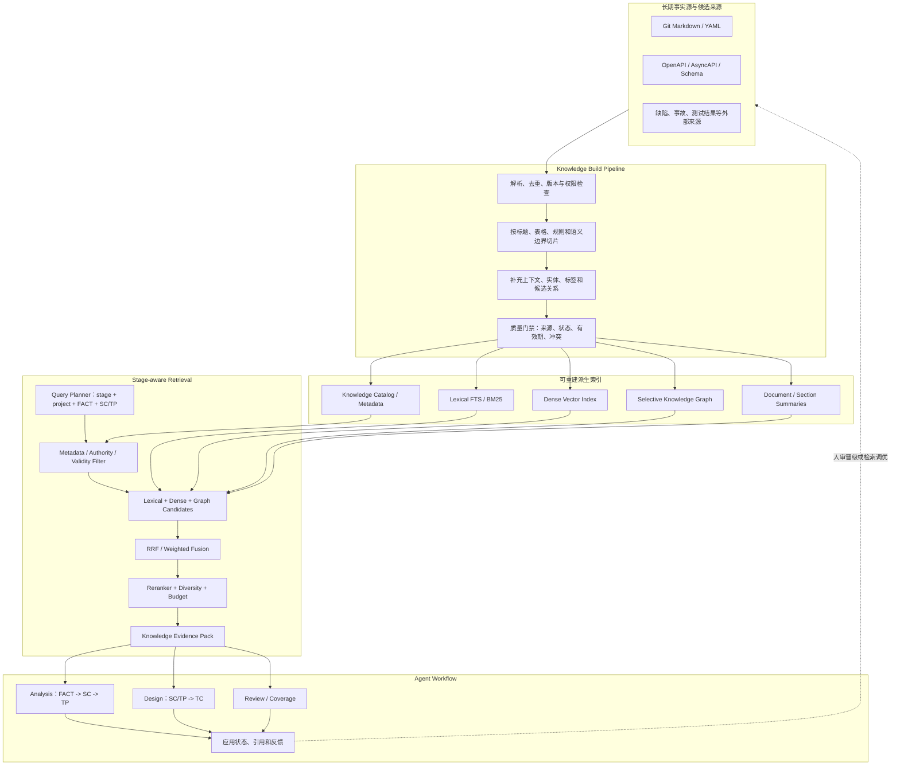
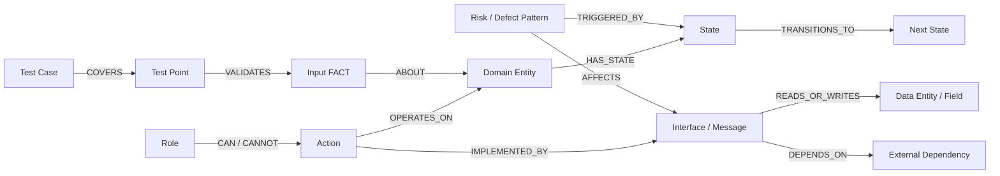

# Knowledge 技术架构演进方案 2.0（讨论稿）

> 状态：Draft，供架构讨论和小范围验证，不是当前运行时契约。  
> 目标：为 AI 辅助测试分析与测试设计提供更精准、可追溯、可评测的知识供给能力，同时保持本仓库 local-first、Git 可审阅和 canonical JSON 的工程特征。

## 1. 结论先行

Knowledge 2.0 不建议简单等同于“上一个向量数据库”，也不建议一开始就把全部知识改造成知识图谱。推荐的目标形态是：

```text
Git 中可审阅的 Markdown / 结构化知识源
  -> 可重建的知识目录与多粒度切片
  -> Metadata Filter + Lexical + Dense 的 Hybrid RAG
  -> RRF / Reranker 精排
  -> 对状态、权限、接口、风险、覆盖关系做选择性图谱扩展
  -> 形成带来源证据的阶段级 Knowledge Context
  -> Analysis / Design Skill 使用并记录应用结果
```

核心判断如下：

1. **RAG 应成为默认检索底座，但必须是 Hybrid RAG，不是纯向量 Top-K。** 测试知识中有大量接口名、字段名、状态、错误码、配置项和 ID，词法精确匹配不可替代；业务语义和相似缺陷模式又需要向量召回。
2. **知识图谱是定向增强，不是默认主存储。** 它最适合状态迁移、角色权限、业务对象生命周期、接口依赖、风险传播和 FACT-SC-TP-TC 追踪等多跳关系；写作规范、短方法说明和精确字段查询不需要图谱。
3. **Markdown/Git 继续作为长期知识事实源。** 全文索引、向量、图节点和摘要都是可重建派生物，不能成为不可审阅的第二事实源。
4. **检索必须感知 workflow 阶段和当前工作单元。** Analysis 生成某个叶子 SC 的 TP，与 Design 生成某个 TP 的 TC，需要的知识类型和检索查询不同。
5. **先进性必须通过效果门禁。** 是否引入向量、重排、图谱或层次摘要，必须由检索召回、引用准确性、覆盖提升、Review blocking 降低、Token/延迟成本等指标证明，而不是凭架构复杂度判断。

## 2. 当前 1.x 基线与主要问题

当前机制具有几个值得保留的优点：

- `knowledge/`、`rules/`、`memory/` 边界明确。
- core knowledge 由 Workflow/Skill 固定引用，project/personal 动态来源经 `context-pack.json` 暴露。
- `context-source-indexing` 只索引路径、名称、描述和阶段可见性，不把动态来源静默注入上下文。
- 后续阶段必须记录来源应用状态，业务事实仍以当前输入为准。
- 所有来源都可在 Git 或 run 产物中追踪，不依赖黑盒知识服务。

但随着项目知识量增长，文件级索引会出现以下瓶颈：

| 问题 | 当前表现 | 对测试分析/设计的影响 |
|---|---|---|
| 召回粒度过粗 | 先命中文件，再由模型读相关章节 | 大文件消耗上下文，局部关键知识容易被稀释 |
| 精确与语义检索割裂 | 主要依赖文件名、description、关键词和模型补读 | 接口/字段精确匹配与相似风险模式难同时兼顾 |
| 缺少关系检索 | 知识以独立 Markdown 为主 | 状态、角色、接口、对象、风险之间的多跳关系需要模型临时拼接 |
| 缺少知识质量状态 | 只有来源和阶段可见性 | 无法区分草案、已评审、过期、冲突和低可信候选 |
| 缺少检索效果评测 | 只检查文件和产物结构 | 不知道“检索到了什么”是否真正提升 SC/TP/TC 质量 |
| 增量影响较弱 | 输入和工作项有 hash，知识内容缺少细粒度依赖 | 知识更新后难以精确判断需重开哪些 SC/TP |
| 经验沉淀链路不足 | memory 可保存历史经验，但缺少候选晋级机制 | Review、coverage、缺陷结果无法稳定转化为高质量知识 |

Knowledge 2.0 应扩展当前机制，而不是推翻它。`context-pack.json` 仍可承担来源绑定和可见性索引，新增的检索计划、知识证据包和派生索引围绕它工作。

## 3. 哪些知识对 AI 辅助测试真正有用

不建议只按目录划分知识。更有效的方式是同时使用“语义类型、作用域、权威性、适用阶段、有效时间”五个维度。

### 3.1 核心知识分类

| 知识类别 | 典型内容 | Analysis 价值 | Design 价值 | 推荐表达 |
|---|---|---|---|---|
| 测试标准与边界 | SC/TP/TC 粒度、字段、编号、可追溯性、保守预期 | 防止 TP 过细、场景树混乱 | 防止 TC 不可执行、字段缺失 | Markdown 标准，固定引用 |
| 测试技术与启发 | 等价类、边界、状态迁移、决策表、组合、风险分析 | 识别验证目标和分析维度 | 推导测试因子和最小充分用例集 | 方法卡片 + 适用信号 + 反例 |
| 领域术语与业务对象 | 术语、同义词、实体、对象属性、生命周期 | 正确理解需求和建立场景树 | 形成具体数据和状态前置 | 术语表 + 实体卡片 |
| 业务流程与状态 | 主流程、分支、补偿、状态机、前后置条件 | 构造 SC、路径和状态类 TP | 设计状态组合、迁移和恢复 TC | 结构化状态/流程 + 原文证据 |
| 业务规则与判定 | 条件、动作、优先级、互斥、阈值、例外 | 形成规则点、决策点 TP | 展开正反例、边界和组合 TC | 决策表/规则卡片 |
| 角色权限与租户边界 | 角色、资源、动作、数据范围、授权条件 | 识别权限场景和风险 | 展开角色×动作×数据范围用例 | 权限矩阵 + 图关系 |
| 接口与集成契约 | 端点、消息、回调、字段、鉴权、幂等、时序、错误语义 | 按接口/集成点组织 TP | 展开契约、异常、重试、超时、幂等 TC | OpenAPI/AsyncAPI/表格 + 文本说明 |
| 数据约束与一致性 | 主键、唯一性、精度、数据血缘、同步窗口、对账规则 | 识别数据类 TP | 形成数据准备、校验和恢复用例 | Schema + 约束卡片 + 血缘边 |
| 质量属性与运行约束 | 性能、容量、可靠性、恢复、安全、兼容性 | 形成非功能风险和 TP | 形成负载、故障、恢复、兼容 TC | 指标模板 + 适用条件 |
| 风险模式与历史缺陷 | 典型失效模式、事故、缺陷簇、易错模块、触发条件 | 提升风险识别，避免漏测 | 形成高价值反例和故障注入因子 | 证据化风险/缺陷卡片 |
| 测试数据策略与 Oracle | 数据构造、脱敏、时间/地域/账户组合、可观察点、判定方法 | 一般只提供可测性提示 | 直接提升数据具体性和预期可判定性 | 数据配方 + Oracle 卡片 |
| 执行形态与平台约束 | GUI/API/CLI 风格、环境能力、自动化限制、平台字段映射 | 影响可测性和范围 | 影响步骤写法、数据准备和交付适配 | 执行指南/平台映射 |
| 负面知识与反模式 | 已知不可用做法、误判模式、历史无效检查、禁用推断 | 避免编造和错误拆点 | 避免伪步骤、空泛预期和重复 TC | 反模式卡片 + 原因 + 替代方案 |

### 3.2 不应直接进入 Knowledge 的内容

以下内容必须与长期知识区分：

- **当前需求/设计事实**：属于当前 run 的 `input-fact-model.json`，不能因为被索引就变成长期真理。
- **强制规则**：继续属于 `rules/`，优先级和加载链路不能被普通 RAG 排名稀释。
- **未审查的模型推断**：只能作为 candidate，不得直接成为 active knowledge。
- **单次 run 的 SC/TP/TC**：是交付产物，不自动晋级为知识；只有抽象出的、经人审确认的模式才可沉淀。
- **已失效的接口、状态或策略**：可以保留历史版本用于追溯，但默认检索必须过滤。
- **Skill 内部实现材料**：继续随对应 Skill 维护，不并入通用知识检索域。

### 3.3 建议的知识语义类型枚举

2.0 可以为每个知识单元增加 `knowledgeType`，初始控制在以下集合，避免过早建立庞大本体：

```text
standard
test-technique
glossary
domain-entity
business-flow
state-model
business-rule
permission-model
interface-contract
data-constraint
quality-attribute
risk-pattern
defect-pattern
test-factor
test-data-strategy
test-oracle
execution-guideline
anti-pattern
```

分类用于过滤、路由和评测，不代表目录必须完全按同样方式拆分。

## 4. Knowledge Object：从“文件”演进为“可追踪知识单元”

文件仍是作者维护单位，但检索和应用单位应升级为 `Knowledge Object`。一个文件可以包含一个或多个知识单元，每个单元保持到原始文件和章节的稳定引用。

建议的最小元数据：

```yaml
knowledgeId: KNO-PAYMENT-IDEMPOTENCY-001
name: payment-idempotency-risk
description: 支付创建和回调链路中的幂等风险、触发条件与测试启发。
knowledgeType: risk-pattern
scope: project
projectKey: payment
stages:
  - testing-method-router
  - test-analysis-solution-generation
  - test-design-solution-generation
status: active
authority: reviewed-guidance
validFrom: 2026-01-01
validTo: null
tags: [payment, idempotency, callback, retry]
entities: [PaymentOrder, PaymentCallback]
sourceRefs:
  - path: memory/projects/payment/incidents/payment-duplicate-callback.md
    section: 复盘结论
review:
  reviewedBy: test-architecture-group
  reviewedAt: 2026-06-20
```

建议补充以下设计：

- `knowledgeId` 在知识生命周期内稳定，文件移动不改变 ID。
- `status` 至少支持 `candidate / active / deprecated / rejected`。
- `authority` 区分核心标准、已评审项目指导、历史证据和个人启发；它不是检索相似度。
- `validFrom/validTo` 支持接口版本、业务策略和组织规范的时间有效性。
- `sourceRefs` 必须能回到原始证据；模型生成的摘要不是唯一来源。
- `contentHash`、`embeddingModel`、`embeddingVersion`、`indexedAt` 写入派生索引，不污染作者维护的正文。
- `sensitivity`、`accessScope` 为未来接入缺陷库、事故库和客户数据预留治理字段。

## 5. 目标技术架构

### 5.1 总体结构



### 5.2 四层存储模型

| 存储层 | 推荐技术 | 是否事实源 | 说明 |
|---|---|---|---|
| Authoring Store | Git + Markdown/YAML；可附 OpenAPI、AsyncAPI、JSON Schema | 是 | 可评审、可 diff、可版本化，延续当前仓库优势 |
| Knowledge Catalog | Phase 1 使用 SQLite；团队化后使用 PostgreSQL | 否，可重建 | 保存单元、版本、来源、类型、作用域、阶段、有效期、权限和 hash |
| Retrieval Index | SQLite FTS5 + 可插拔向量索引；团队化后 PostgreSQL FTS + pgvector 或专用检索服务 | 否，可重建 | 同时支持精确词法和语义召回 |
| Graph Projection | 初期使用关系表/邻接表；达到规模和多跳需求后评估 Neo4j 等图数据库 | 否，可重建 | 只保存有价值且可追溯的实体关系，不复制全部正文 |

推荐优先采用本地 SQLite，是因为当前项目本身是独立 Agent 包，便携性和零服务依赖比横向扩展更重要。SQLite 官方 FTS5 支持短语、前缀、NEAR、布尔组合和自定义 tokenizer，足以承担第一阶段词法检索。[SQLite FTS5 官方文档](https://www.sqlite.org/fts5.html)

向量能力应通过 provider 接口解耦。可评估 `sqlite-vec` 作为本地实验选项，但它目前仍声明为 pre-v1，不能直接成为不可替换的核心契约。[sqlite-vec 项目](https://github.com/asg017/sqlite-vec)

如果知识规模、并发和团队共享需求明显增长，推荐优先迁移到 PostgreSQL：原生全文检索负责 lexical，`pgvector` 负责 dense，元数据、版本和关系边可以继续使用关系表，避免过早引入多套存储。pgvector 官方也建议与 PostgreSQL 全文检索结合，并可用 RRF 或 cross-encoder 合并结果。[PostgreSQL 全文检索](https://www.postgresql.org/docs/current/textsearch-intro.html)、[pgvector Hybrid Search](https://github.com/pgvector/pgvector#hybrid-search)

### 5.3 索引构建策略

知识切片不能只按固定 Token 长度，应优先遵守内容结构：

1. 标题层级、表格、规则列表、状态机、接口定义和示例保持原子性。
2. 每个 chunk 附带文档名、章节路径、knowledge type、scope、project、版本和适用阶段。
3. 对脱离全文后语义不完整的 chunk，生成简短的 chunk context，但必须保留原始正文和来源。
4. 同时建立 document、section、chunk 三个粒度；长文档可按需增加层次摘要。
5. 表格既保存 Markdown 原文，也派生行级结构，避免权限矩阵或决策表被普通文本切片破坏。
6. 接口、状态、角色和实体关系优先从结构化来源抽取；LLM 抽取只生成候选关系，必须通过规则或人审确认。
7. 索引记录源文件 hash、切片算法版本、embedding 模型版本，任何一项变化均可增量重建。

Contextual Retrieval 的公开实验表明，把 chunk 放回文档上下文后再做词法和向量索引，并配合 reranking，可以显著降低检索失败；但实际收益仍需在本项目数据上复测。[Anthropic Contextual Retrieval](https://www.anthropic.com/engineering/contextual-retrieval)

对于较长的架构文档、事故复盘或产品域知识，可以借鉴 RAPTOR 的多层摘要思想，让查询同时命中局部细节和上层主题，而不必把整篇文档塞入上下文。[RAPTOR 论文](https://arxiv.org/abs/2401.18059)

## 6. 检索方案：Hybrid RAG 作为默认路径

经典 RAG 将模型参数知识与外部非参数知识源结合，使知识可以更新并保留来源。[RAG 原始论文](https://arxiv.org/abs/2005.11401) 对本项目而言，更重要的不是“是否叫 RAG”，而是检索链路是否针对测试任务设计。

### 6.1 查询规划

检索查询不应直接等于用户原始问题。Query Planner 至少读取：

- 当前 workflow stage。
- `project-key`、产品/模块和版本。
- 当前 run 的 FACT、需求关键词和设计实体。
- 当前工作单元：场景树、叶子 SC 或 TP。
- 当前缺口类型：状态、角色、接口、数据、风险、质量属性等。
- 可用的 Token、延迟和候选数量预算。

Planner 输出多个受控子查询，而不是让 Agent 无限制自主搜索。例如生成某个支付回调 TP 时，可以并行形成：

```text
exactQuery: "PaymentCallback callbackId 幂等 重试"
semanticQuery: "重复回调和乱序通知可能导致的状态与数据风险"
graphSeeds: [PaymentCallback, PaymentOrder]
knowledgeTypes: [interface-contract, state-model, risk-pattern, defect-pattern]
stage: test-design-solution-generation
```

### 6.2 候选召回与融合

推荐默认顺序：

1. 先按 project、stage、status、valid time、authority、sensitivity 做硬过滤。
2. Lexical 通道召回接口名、字段、ID、状态、错误码和精确术语。
3. Dense 通道召回语义相似的风险、缺陷、测试因子和方法说明。
4. 对命中的实体做一到两跳图扩展，只取允许的关系类型。
5. 使用 Reciprocal Rank Fusion 合并不同通道，避免直接比较不同分数尺度。
6. 使用 reranker 对候选与当前 SC/TP 的真实相关性精排。
7. 执行去重、来源多样性、权威性和 Token 预算约束。
8. 输出结构化 evidence pack，而不是只拼接若干无来源文本块。

Hybrid retrieval 能同时覆盖精确词法与语义相关性，RRF 是缺少统一分数标尺时的稳健起点；有标注 eval set 后再调权重。[Qdrant Hybrid Queries 对 RRF 的说明](https://qdrant.tech/documentation/search/hybrid-queries/)

### 6.3 Knowledge Evidence Pack

建议每个阶段或工作项形成独立证据包，例如：

```json
{
  "artifactType": "knowledge-evidence-pack",
  "schemaVersion": "2.0-draft",
  "stage": "test-design-solution-generation",
  "workItemId": "TP-017",
  "queryPlan": {
    "exactQueries": [],
    "semanticQueries": [],
    "graphSeeds": [],
    "filters": {}
  },
  "selectedEvidence": [
    {
      "knowledgeId": "KNO-PAYMENT-IDEMPOTENCY-001",
      "chunkId": "KNO-PAYMENT-IDEMPOTENCY-001#risk-cases",
      "sourcePath": "knowledge/projects/payment/risk-patterns.md",
      "section": "重复回调",
      "sourceHash": "...",
      "authority": "reviewed-guidance",
      "retrievalChannels": ["lexical", "dense", "graph"],
      "whySelected": "与当前 TP 的回调幂等和重试验证目标直接相关"
    }
  ],
  "rejectedEvidence": [],
  "graphPaths": [],
  "budget": {
    "candidateCount": 50,
    "selectedCount": 8,
    "estimatedTokens": 3200
  }
}
```

注意：retrieval score 表示“与查询相关”，不表示知识为真。真实性仍由 authority、来源、有效期、冲突状态和输入优先级决定。

### 6.4 与现有 Generation Context 的结合

建议保留当前 `generationContext`，但把知识部分由“可见文件列表”演进为“本工作项已选择的 evidence pack”：

```text
context-pack.json
  负责 project/personal 来源绑定和可见性

knowledge-retrieval-plan.json
  负责本阶段的检索策略、预算和重开条件

process/knowledge-evidence/<stage>/<work-item>.json
  负责当前 SC/TP/review 工作项的检索证据

generationContext
  引用或内联最终选择的少量证据，并保留 source/hash/section
```

Rules 仍通过 rules-pack 独立加载，不进入普通检索排序。当前输入 FACT 仍由 input-fact-model 提供，不得被 knowledge evidence 覆盖。

## 7. 知识图谱：应该做什么，不应该做什么

### 7.1 推荐采用“选择性领域图谱”

图谱优先建模对测试覆盖有直接价值的关系：



每条边至少保存：

- `sourceRef` 与 source hash。
- `relationType`。
- `scope/project/version`。
- `validFrom/validTo`。
- `extractionMethod`：structured、rule-based、llm-candidate、human-authored。
- `reviewStatus`。

未评审的 LLM 抽取关系不能作为业务事实直接进入 Analysis/Design，只能用于召回候选或提示人工确认。

### 7.2 图谱特别有价值的任务

- 状态机完整性：入边、出边、非法迁移、回退、补偿和终态。
- 权限矩阵覆盖：角色×动作×资源×数据范围。
- 接口和数据依赖：端点、消息、回调、字段、外部依赖和一致性链路。
- 变更影响分析：知识、接口或状态变化影响哪些 SC/TP/TC 工作项。
- 风险传播：某类历史缺陷与哪些状态、接口、依赖和质量属性相关。
- Coverage 追踪：FACT-SC-TP-TC 路径的完整性和孤立节点。

### 7.3 不建议图谱化的内容

- 短小的写作规范和模板说明。
- 主要依赖精确文本的字段、错误码、命令或配置片段。
- 尚未稳定的个人偏好和单次会话信息。
- 没有可靠来源、只能由模型猜测的实体关系。
- 为了“图谱覆盖率”而把所有段落、句子和 chunk 都创建成业务实体。

### 7.4 是否直接采用 GraphRAG

Microsoft GraphRAG 擅长从大规模非结构化语料中抽取实体关系、构建 community，并处理局部实体查询和面向全语料的 global sensemaking。[GraphRAG 论文](https://arxiv.org/abs/2404.16130)、[GraphRAG Query Engine](https://github.com/microsoft/graphrag/blob/main/docs/query/overview.md)

但本项目的核心查询通常不是“整个语料有哪些主题”，而是“当前 SC/TP 还需要哪些状态、权限、接口和风险覆盖”。因此建议：

- 先实现结构化来源优先的领域图谱和局部多跳扩展。
- 只有当项目积累大量事故复盘、缺陷描述和长篇领域文档，并出现全局归纳需求时，再试验 GraphRAG community/global search。
- 不把 Microsoft GraphRAG 直接设为 2.0 基础依赖。其官方仓库明确提示索引可能昂贵，并定位为方法演示而非正式受支持产品。[Microsoft GraphRAG Repository](https://github.com/microsoft/graphrag)

## 8. Analysis 与 Design 的阶段化知识路由

### 8.1 Analysis

| Analysis 阶段 | 优先知识 | 检索方式 | 禁止行为 |
|---|---|---|---|
| input-fact-modeling | 术语、实体定义、设计约定 | exact + metadata，少量 semantic | 不把 knowledge 改写为需求事实 |
| testing-method-router | 测试技术、风险模式、质量属性 | semantic + lexical signals | 不提前生成 TP/TC |
| scenario-tree generation | 业务流程、对象生命周期、角色边界 | hierarchical + graph local search | 不用历史方案替代当前需求 |
| TP slice generation | 状态、规则、权限、接口、风险模式 | hybrid + work-item query + graph expansion | 不把数据变体拆成独立 TP |
| analysis review | SC/TP 标准、反模式、已知遗漏模式 | fixed standards + targeted retrieval | 不重复 lint，不引入无输入依据的业务规则 |
| analysis coverage | 覆盖 rubric、当前 FACT-SC-TP 证据 | canonical map 为主，knowledge 只提供审查视角 | 不因知识建议而伪造 FACT gap |

### 8.2 Design

| Design 阶段 | 优先知识 | 检索方式 | 禁止行为 |
|---|---|---|---|
| TP work-item planning | TP 类型、关联实体、来源 FACT | metadata + graph seed | 不改写冻结 SC/TP |
| test factor identification | 边界、状态、角色、组合、故障、历史缺陷 | hybrid + risk/defect expansion | 不把已有因子库当作封闭上限 |
| TC generation | 测试数据策略、Oracle、接口契约、执行形态 | exact + semantic + rerank | 不编造阈值、错误码或状态变化 |
| test-case-writing | 公共写作标准、GUI/API/CLI 风格、平台映射 | fixed standards + metadata | 不改变 canonical 覆盖事实 |
| design review | 可执行性反模式、历史遗漏、预期判定标准 | targeted retrieval | 不用检索结果替代当前 TP 目标 |
| design coverage | 当前 FACT-SC-TP-TC 证据链 | canonical map 为主 | 不在 final report 阶段新增 missing 判断 |

## 9. 知识治理与学习闭环

### 9.1 知识生命周期

```text
candidate
  -> 自动去重、来源与敏感性检查
  -> 专家评审
  -> active
  -> 使用反馈与定期复核
  -> deprecated / superseded / rejected
```

Review finding、coverage gap、线上缺陷和执行结果可以生成 candidate，但不能自动成为 active knowledge。晋级时应回答：

- 这是当前需求事实，还是可跨 run 复用的模式？
- 是否有可验证来源？
- 适用于 core、project 还是 user？
- 是强制规则、普通知识还是历史证据？
- 有效范围、版本和失效条件是什么？
- 它改善了哪个评测样本或真实问题？

### 9.2 冲突处理

同一知识对象出现冲突时，不应让向量相似度决定胜负。建议按以下顺序处理：

1. 当前用户明确指令。
2. 当前阶段适用 rules。
3. 当前需求和设计事实。
4. 在有效期内、作用域更具体、权威性更高的知识。
5. 历史 memory 和一般 knowledge。

冲突来源都应进入 evidence pack，记录 `conflict` 和最终采用依据；不能静默丢弃旧版本导致无法审计。

### 9.3 安全与权限

- 嵌入服务不得绕过源文档的访问权限。
- 检索前做 access filter，不能检索后才删除敏感结果。
- 缺陷、事故、客户数据和生产日志默认不能进入公共 core knowledge。
- 向量和摘要同样可能泄露敏感语义，应与原文采用同等级别保护。
- 删除或权限变更必须触发所有派生索引、缓存和图边的清理。

## 10. 评测体系：证明知识架构确实提升效果

Knowledge 2.0 上线前应建立专门的 retrieval/grounding eval，不应只跑现有结构 smoke。

### 10.1 三层指标

| 层级 | 指标 | 目的 |
|---|---|---|
| Retrieval | Recall@K、MRR、nDCG、精确术语命中率、图路径命中率 | 判断正确知识是否被找回和排在前面 |
| Context/Grounding | evidence precision、引用可追溯率、冲突识别率、上下文利用率、无依据主张率 | 判断模型是否使用了正确证据 |
| Task Outcome | FACT 覆盖、SC/TP 漏项、TP 重复率、TC 因子充分性、Review blocking 数、coverage gap 数、Token/延迟/成本 | 判断最终测试方案是否真的更好 |

RAGAS 将 RAG 评估拆为检索上下文、忠实性和回答质量等维度，适合作为参考，但本项目必须增加 SC/TP/TC 与覆盖闭环的领域指标。[RAGAS 论文](https://arxiv.org/abs/2309.15217)

### 10.2 建议的评测数据集

1. 从现有 example fixture 提取 30-50 个明确的知识检索问题。
2. 增加精确型查询：接口、字段、状态、错误码、配置项。
3. 增加语义型查询：相似风险、历史缺陷模式、质量属性。
4. 增加多跳型查询：角色-动作-状态-接口-风险路径。
5. 增加冲突和过期知识查询。
6. 对每个查询标注 must-hit、useful、irrelevant 和 forbidden sources。
7. 建立无 RAG、lexical only、dense only、hybrid、hybrid+rerank、hybrid+graph 的 A/B 基线。

### 10.3 上线门禁示例

- must-hit Recall@10 不低于既有文件级机制，且精确标识符查询显著提升。
- evidence precision 达到可接受阈值，过期/越权知识召回为零。
- Analysis 的遗漏型 blocking 和 Design 的因子不足型 blocking 有稳定下降。
- Token 使用没有因“大量召回但不利用”失控。
- 任一新技术只有在独立消融实验中体现收益才进入默认链路。

## 11. 分阶段演进路线

### Phase 0：先建立基线与语料治理

- 盘点当前 core/project/user knowledge 和 memory。
- 定义 `knowledgeId`、`knowledgeType`、status、authority、valid time。
- 建立 retrieval golden set 和 Analysis/Design 结果基线。
- 不改变现有 Workflow，只记录文件级检索和实际应用情况。

### Phase 1：Knowledge Catalog + Lexical RAG

- 保持 Markdown/Git 为事实源。
- 新增可重建 SQLite catalog 和 FTS5 索引。
- 从 `context-pack` 的文件级发现升级为章节/chunk 级 exact retrieval。
- 对接口、字段、状态、ID 和术语优先验证效果。
- 产出结构化 knowledge evidence pack。

这一步工程风险最低，且有较高概率直接减少上下文浪费和精确知识漏召回。

### Phase 2：Hybrid RAG + Reranking

- 接入可替换 embedding provider，保存模型和索引版本。
- 增加 dense 召回、RRF 融合和可选 reranker。
- 引入 stage/work-item query planner、上下文预算和证据去重。
- 用 A/B 与消融实验决定 Top-K、权重和 reranker 使用范围。

这是建议命名为 Knowledge Architecture 2.0 的正式目标版本。

### Phase 3：Selective Knowledge Graph

- 从状态机、权限矩阵、接口依赖三个高价值场景试点。
- 结构化来源直接建边，LLM 只生成候选关系。
- 增加一到两跳 graph expansion 和影响分析。
- 只有评测证明需要时，才引入独立图数据库或 GraphRAG global search。

### Phase 4：Coverage-guided Learning Loop

- Review blocking、coverage gap、缺陷结果生成 knowledge candidate。
- 人审后晋级 active knowledge。
- 根据失败查询优化标签、同义词、切片、图关系和检索权重。
- 知识更新通过依赖记录精确重开受影响 SC/TP，而不是全量重跑。

## 12. 建议新增的仓库模块（未实施）

以下只是命名草案，用于讨论职责，不代表现在应立即创建：

```text
knowledge/
  catalog-schema.md
  ontology/
    knowledge-types.md
    graph-relations.md

bin/
  build-knowledge-catalog.py
  build-knowledge-index.py
  query-knowledge-index.py
  evaluate-knowledge-retrieval.py

outputs/knowledge-index/       # 默认 gitignore，可完全重建
  catalog.sqlite
  index-manifest.json

outputs/runs/<run-id>/process/
  knowledge-retrieval-plan.json
  knowledge-evidence/
    <stage>/
      <work-item>.json
```

实现时仍应遵守本仓库原则：固定能力不足就扩展仓库脚本，不临时生成脚本处理业务 run；JSON 为过程事实源，Markdown 只做派生阅读版。

## 13. 进一步可探索的思路

### 13.1 Coverage-guided Retrieval

第一次检索不追求一次性找全。SC/TP/TC 初稿生成后，根据 coverage map 中暴露的状态、角色、接口或质量属性空洞，生成受控的二次检索查询，再回到对应切片，而不是无限 Agentic Search。

### 13.2 Test Factor Ontology

为 Design 建立轻量测试因子本体，例如：

```text
input-domain
boundary
state
role
permission-scope
sequence
concurrency
dependency-response
timeout-retry
idempotency
data-consistency
configuration
environment
quality-attribute
```

它可以帮助检测某个 TP 是否遗漏有判定意义的独立因子，但不能变成强制笛卡尔积，也不能把因子直接升级成 TP。

### 13.3 Failure-first Retrieval

除“找类似成功方案”外，优先检索历史缺陷、事故、Review blocking 和无效测试反模式。测试设计通常从失败证据中获得的信息密度高于从历史用例文本中简单仿写。

### 13.4 多粒度和多模态索引

- 文档、章节、知识单元、chunk 多粒度共存。
- 表格保留结构化行列。
- 图片/流程图仍先通过文件归一化转成同位置结构化事实，再进入知识索引。
- 只有图片本身包含无法文本化的视觉语义时，才评估多模态 embedding；不把它作为 2.0 前置依赖。

### 13.5 Provider-neutral Retrieval API

Workflow 只依赖统一查询和 evidence pack 契约，不绑定 SQLite、PostgreSQL、Qdrant、Neo4j 或某个 embedding 模型。这样可以在 local-first 和团队服务之间迁移，也能独立做检索后端消融实验。

## 14. 待讨论的关键决策

以下问题会直接影响 2.0 的第一版范围，适合后续逐项讨论：

1. **首要痛点是什么？** 当前更常见的是找不到知识、读入太多、知识过期，还是历史经验无法复用？
2. **知识规模和部署形态是什么？** 未来仍是单仓库/单用户 local-first，还是会连接团队级知识服务？
3. **外部数据是否纳入？** 是否计划接入缺陷平台、事故复盘、测试管理平台、API 管理平台或运行日志？
4. **首个试点项目是什么？** 最好选择状态、接口、权限或历史缺陷较丰富的一个项目进行 A/B。
5. **Embedding 的数据边界是什么？** 是否允许调用外部模型服务，还是必须本地部署？
6. **谁负责知识晋级？** candidate 到 active 的评审人、SLA 和过期复核机制如何定义？
7. **图谱的首要用例是什么？** 状态完整性、权限覆盖、接口依赖还是变更影响分析？
8. **成功指标的优先级是什么？** 更关注 Coverage、Review blocking、生成成本、速度，还是执行后缺陷发现率？

### 建议的下一轮讨论起点

优先回答第 1、2、4、5 个问题。它们足以决定先做：

- 纯本地 SQLite FTS5 PoC；
- 本地 Hybrid RAG PoC；
- 团队 PostgreSQL + pgvector 服务；
- 或状态/权限/接口之一的选择性图谱试点。

在没有这四项信息前，不建议先确定向量数据库或图数据库品牌。

## 15. 参考资料

- [Retrieval-Augmented Generation for Knowledge-Intensive NLP Tasks](https://arxiv.org/abs/2005.11401)
- [Contextual Retrieval](https://www.anthropic.com/engineering/contextual-retrieval)
- [RAPTOR: Recursive Abstractive Processing for Tree-Organized Retrieval](https://arxiv.org/abs/2401.18059)
- [From Local to Global: A Graph RAG Approach to Query-Focused Summarization](https://arxiv.org/abs/2404.16130)
- [Microsoft GraphRAG repository](https://github.com/microsoft/graphrag)
- [SQLite FTS5](https://www.sqlite.org/fts5.html)
- [PostgreSQL Full Text Search](https://www.postgresql.org/docs/current/textsearch-intro.html)
- [pgvector](https://github.com/pgvector/pgvector)
- [Qdrant Hybrid Queries](https://qdrant.tech/documentation/search/hybrid-queries/)
- [RAGAS: Automated Evaluation of Retrieval Augmented Generation](https://arxiv.org/abs/2309.15217)

