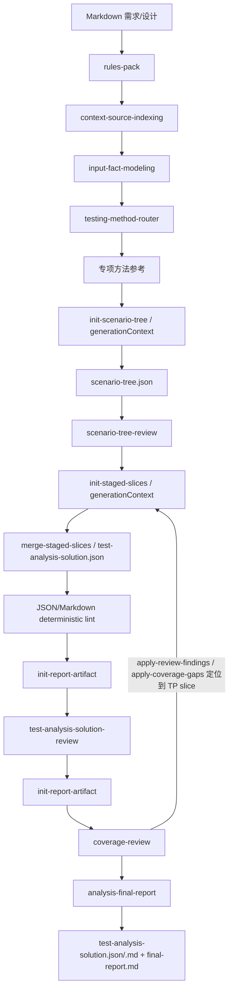

# Test Analysis Agent 设计

`test-analysis-agent` 基于已归一化 Markdown 需求文档和可选设计方案，生成 `SC 场景树 -> TP 测试点` 的测试分析方案。生成过程先冻结 SC 树，再按叶子 SC 生成 TP 切片。

## 边界

| Agent | 目标 | 输入 | 输出 |
|---|---|---|---|
| `@file-normalization-agent` | 文件归一化 | `.docx` / `.xlsx` / `.md` | Markdown 输入事实源 |
| `@test-analysis-agent` | what to test | 已归一化需求和可选设计方案 | `test-analysis-solution.json` |
| `@test-design-agent` | how to test | 已评审测试分析方案 | `test-design-solution.json` |

分析方案不生成测试用例、步骤、测试数据或预期结果。设计阶段在 `TP-*` 下生成 `TC-*`。

## 流程

## 输出结构

- `SC-*`：最多 3 层，先在 `process/scenario-tree.json` 中冻结；该阶段不挂测试点。
- `TP-*`：只在冻结后的叶子场景下生成，全局连续编号，每个叶子场景包含 `E2E场景测试`。
- `basisRefs[]`：需求、设计、规则或动态来源依据。
- 测试技术和专项方法只作为生成参考，不作为主交付字段；TP 通过 `basisRefs[]` 追溯需求、设计、规则或动态来源依据。
- `process/rules-pack.json` 独立索引强制规则；后续阶段按 `ruleSources[]` 读取适用规则正文。`process/context-pack.json` 只索引 project/personal knowledge 和 memory 动态来源。
- `generationContext`：由固定脚本写入 scenario-tree、TP slice 和 review/coverage JSON，只作为生成前工作包，不合并进最终交付件。

## Coverage 返工闭环

`coverage-review` 是最终全局门禁，不在中间切片阶段执行。若 review 输出 blocking findings/issues，必须先运行 `bin/apply-review-findings.py` 按 slice location 重开工作项；若 `reports/analysis-coverage-review.json` 输出 `coverageGaps[]`，必须通过 `coverageGaps[].artifactLocation` 定位到对应 `process/test-point-slices/<SC-ID>.json`，先运行 `bin/apply-coverage-gaps.py` 重开工作项后再修复。

修复后重新执行：TP 切片 review -> `bin/merge-staged-slices.py --scope analysis` -> deterministic lint/render -> 最终分析 review -> coverage-review -> final-report -> `bin/check-staged-run.py --scope analysis`。

coverage-review 通过并完成返工闭环后，运行 `bin/build-final-report.py --scope analysis` 生成 `reports/analysis-final-report.json/.md`，由 `final-report-generation` 填写 FACT 到 SC/TP 的最终覆盖关系。final-report 只供人工审阅，不输出 `coverageGaps[]`，不触发自动返工。

不得直接编辑最终 Markdown，也不得绕过切片回写直接手改 `deliverables/test-analysis-solution.json`。

## 校验

- `python bin/lint-run-json.py outputs/runs/<run-id>`
- `python bin/render-run-markdown.py outputs/runs/<run-id> --check`
- `python bin/lint-test-analysis-solution.py outputs/runs/<run-id>/deliverables/test-analysis-solution.md`
- `python bin/check-artifact-consistency.py outputs/runs/<run-id>`
- `python bin/check-staged-run.py outputs/runs/<run-id> --scope analysis`
