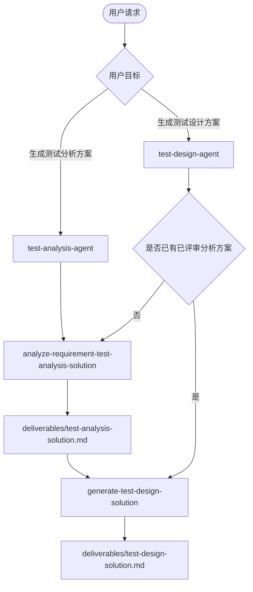
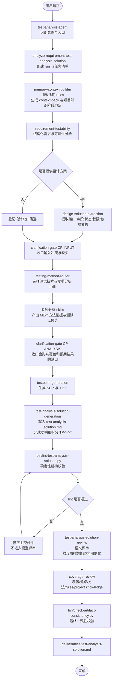

# Test Analysis Agent 设计文档

## 目标

本 Agent 面向 Markdown 需求文档和可选设计方案文档，输出 `测试分析方案`。它是独立项目，所有运行入口、Agent 门面、知识库、模板、质量门禁和校验脚本都在本仓库内维护，不依赖其他 Agent 项目或外部仓库结构。

主交付件回答 what to test，输出粒度为：

```text
测试场景 -> 测试点 -> 测试点明细
非成功测试点明细 -> 失败类型明细
```

`测试点明细` 是测试分析层的规则分支、路径分支、状态分支、权限分支、接口契约分支或风险分支。若 `TP-*-*` 是非成功测试点明细，则新增 `TP-*-*-*` 失败类型明细继续拆分失败来源。它不是 `TDI-*` 测试设计项，不表达具体代表性条件、数据、状态或组合。`@test-design-agent` 可在人工评审后的测试分析方案上继续补充 TDI。

## 双 Agent 边界

本仓库维护两个子 Agent：

| Agent | 主问题 | 主输入 | 主输出 |
|---|---|---|---|
| `@test-analysis-agent` | what to test | 需求文档、可选设计方案 | `test-analysis-solution.md`，输出 `SC-* / TP-* / TP-*-*`，非成功明细可到 `TP-*-*-*` |
| `@test-design-agent` | how to test | 已评审测试分析方案、可选需求/设计依据 | `test-design-solution.md`，在普通 `TP-*-*` 或失败类型 `TP-*-*-*` 下补充 `TDI-*` |

分析 Agent 不输出 `TDI-*`；设计 Agent 不擅自新增分析层级。若设计阶段发现分析方案缺口，应记录过程问题，必要时回到分析 Agent 修正。

## 主交付件

固定路径：

```text
outputs/runs/<run-id>/deliverables/test-analysis-solution.md
```

新建完整分析 run 时，`run-id` 固定使用 `python bin/generate-run-id.py` 生成，格式为 `<YYYYMMDD-HHMMSS>`。

固定术语与缩写：

| 中文术语 | 缩写/ID |
|---|---|
| 测试场景 | `SC-*` |
| 测试点 | `TP-*` |
| 测试点明细 | `TP-*-*` |
| 失败类型明细 | `TP-*-*-*` |

主交付件不展开英文全名，不使用 `TDI-*`、`TD-*`、`TC-*`、`TCT-*`、`TI-*`、`ITP-*` 或 `ITDI-*`。

## 输出样例

```markdown
# 订单下发 测试分析方案

## 1. 需求范围

## 2. 测试场景与测试点

### SC-001 订单下发

#### TP-001 E2E场景测试

##### TP-001-001 订单下发主流程成功闭环

- 测试点详情：验证订单下发场景的端到端主流程能够从请求接收到订单处理结果完成闭环。

- 预期结果：订单下发成功。

#### TP-002 验证下发订单 ID 长度规则

##### TP-002-001 下发订单 ID 满足长度要求

- 测试点详情：验证下发订单 ID 符合需求定义的长度规则时，系统能够正常识别并处理订单下发请求。

- 预期结果：下发成功。

##### TP-002-002 下发订单 ID 不满足长度要求

###### TP-002-002-001 下发订单 ID 长度小于规则要求

- 测试点详情：验证下发订单 ID 长度短于需求定义的长度规则时，系统能够识别为无效订单 ID 并拒绝处理订单下发请求。

- 预期结果：下发失败；具体错误处理待人工分析确认。

###### TP-002-002-002 下发订单 ID 长度大于规则要求

- 测试点详情：验证下发订单 ID 长度长于需求定义的长度规则时，系统能够识别为无效订单 ID 并拒绝处理订单下发请求。

- 预期结果：下发失败；具体错误处理待人工分析确认。
```

## Agent 协作流程



## 测试分析主运行流程



## Skill 分工

| 层级 | Skill | 职责 |
|---|---|---|
| Agent 门面 | `test-analysis-agent` | 识别用户意图，路由生成、记录、咨询和框架维护任务 |
| 主入口 | `analyze-requirement-test-analysis-solution` | 固定根目录、创建 run、编排全链路、输出主交付件 |
| 上下文 | `memory-context-builder` | 发现适用 rules、core/project/personal 上下文和项目知识阶段绑定 |
| 需求分析 | `requirement-testability` | 结构化需求模型、识别可测性缺口 |
| 设计提取 | `design-solution-extraction` | 提取接口、字段、状态、权限、数据依赖和设计缺口 |
| 缺口治理 | `clarification-gate` | 合并过程缺口，不向主交付件写独立待确认章节 |
| 方法路由 | `testing-method-router` | 选择适用测试技术和专项分析 skill |
| 专项分析 | 各专项 `*-analysis` skill | 生成方法证据、测试点候选和技术缺口 |
| 测试点生成 | `testpoint-generation` | 生成 `SC-*` 和 `TP-*` |
| 测试分析方案生成 | `test-analysis-solution-generation` | 生成并写入 `TP-*-*` 测试点明细和预期结果；非成功测试点明细继续拆分 `TP-*-*-*` |
| 确定性校验 | `bin/lint-test-analysis-solution.py` | 检查结构、编号、字段、Markdown 语法、禁用术语、E2E 存在性和第四层格式；失败时不进入模型评审 |
| 独立评审 | `test-analysis-solution-review` | 只检查语义质量：测试点明细粒度、失败类型拆分充分性、预期结果依据、事实溯源和非用例化倾向 |
| 覆盖审查 | `coverage-review` | 检查需求覆盖、方法覆盖、追踪关系、rules 应用、项目知识应用和过程门禁；不重复 lint 已覆盖的结构规则 |

## Knowledge 分工

| 路径 | 作用 |
|---|---|
| `knowledge/test-analysis-methodology.md` | 定义测试分析、测试设计、测试技术之间的边界 |
| `knowledge/test-analysis-solution-standard.md` | 定义主交付件结构、字段和兜底规则 |
| `knowledge/testpoint-standard.md` | 定义测试点粒度、分类和非用例化约束 |
| `knowledge/test-techniques/` | 测试技术库，支持分析阶段识别覆盖分支，也可供 `@test-design-agent` 复用 |
| `knowledge/test-method-routing-matrix.md` | 测试技术与专项 skill 路由参考 |
| `knowledge/basic-test-types.md` | 基础测试类型参考 |
| `knowledge/method-evidence-standard.md` | 方法证据 `ME-*` 记录标准 |

## Rules 分工

`rules/` 保存强制规则，优先级低于当前用户明确指令，但高于需求文档、设计方案、已评审测试分析方案、memory 和 knowledge。

| 路径 | 作用 |
|---|---|
| `rules/*.md` | 全局强制规则 |
| `rules/projects/<project-key>/**/*.md` | 项目级强制规则，确定 `project-key` 后读取 |
| `rules/user/**/*.md` | 个人本地强制规则，不得覆盖 core/project rules |

适用 rules 必须进入 `process/context-pack.md` 的“适用强制规则”表；与输入冲突时默认遵守 rules，并在“Rules 与输入冲突记录”中留痕。

## Project Knowledge 应用

`knowledge/projects/<project-key>/` 下的文件名没有硬性要求。context pack 阶段只判断文件用途和强制应用环节，不提前判断具体测试点或测试点明细命中。

- 测试设计因子库、业务测试设计模式库可绑定到 `testing-method-router`、`testpoint-generation`、`test-analysis-solution-generation` 和 `test-design-solution-generation`。
- 测试设计 checklist 默认绑定到 `coverage-review` 统一查漏；只有文件或用户指令明确要求产物语义评审时，才额外绑定到 `test-analysis-solution-review` 或 `test-design-solution-review`。
- 被绑定到某阶段的 project knowledge，该阶段必须读取相关章节并输出应用状态。
- 应用状态只能使用 `applied`、`not_applicable`、`insufficient_evidence`、`conflict_with_requirement` 或 `deferred_to_review`。

## 质量门禁

确定性结构、编号、字段、Markdown 语法和固定章节问题以 `bin/lint-test-analysis-solution.py` 为事实源；模型型 review 不重复逐项检查，只消费脚本结果并继续做语义和覆盖判断。

- 主输出必须按 `测试场景 -> 测试点 -> 测试点明细` 组织。
- 每个测试场景必须包含 `E2E场景测试` 测试点。
- `E2E场景测试` 是独立同级测试点，只维护 1 个端到端主流程成功闭环测试点明细；其他业务规则、异常处理、接口契约、权限、状态、回滚或补偿分支必须拆为同级 `TP-*`。
- 当需求、设计方案或用户任务明确要求接口测试/API 契约覆盖时，接口测试或集成覆盖场景下的非 E2E `TP-*` 必须先按接口、端点、消息、回调或集成点组织；字段、状态码、错误码、鉴权、幂等、超时和重试作为该接口 `TP-*` 下的明细或失败类型，不作为无法定位目标接口的泛化 `TP-*`。
- 每个测试点至少有一个测试点明细。
- 非成功测试点明细必须新增 `TP-*-*-*` 失败类型明细；是否新增第四层由 `TP-*-*` 决定，不由 `TP-*` 决定。
- 每个普通测试点明细必须包含 `测试点详情` 和 `预期结果`；非成功测试点明细由第四层失败类型明细承载 `测试点详情` 和 `预期结果`。
- 主输出不得出现 `TDI-*`、`测试设计项` 或测试设计项表格。
- 主输出不得出现旧版主交付件字段；字段禁用清单以 `bin/lint-test-analysis-solution.py` 为准。
- 主输出不得使用 Markdown 加粗语法，例如 `**文本**` 或 `__文本__`。
- 主输出不得包含完整测试用例字段、操作步骤、脚本或执行数据。
- 依据不足的预期结果必须写 `待人工分析确认`。
- 适用 rules 必须被执行、解释不适用，或记录被当前用户明确指令覆盖。

## 校验命令

```bash
python bin/sync-opencode-skills.py --check
python bin/validate-agent-runtime.py
python bin/lint-test-analysis-solution.py outputs/runs/<run-id>/deliverables/test-analysis-solution.md
python bin/check-artifact-consistency.py outputs/runs/<run-id>
```

`python bin/smoke-test-analysis.py` 只用于框架回归或示例 fixture 变更后的 smoke 检查，不属于单次测试分析方案 review 阶段。
