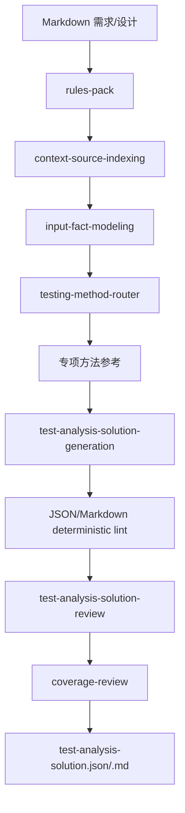

# Test Analysis Agent 设计

`test-analysis-agent` 基于已归一化 Markdown 需求文档和可选设计方案，生成 `SC 场景树 -> TP 测试点` 的测试分析方案。

## 边界

| Agent | 目标 | 输入 | 输出 |
|---|---|---|---|
| `@file-normalization-agent` | 文件归一化 | `.docx` / `.xlsx` / `.md` | Markdown 输入事实源 |
| `@test-analysis-agent` | what to test | 已归一化需求和可选设计方案 | `test-analysis-solution.json` |
| `@test-design-agent` | how to test | 已评审测试分析方案 | `test-design-solution.json` |

分析方案不生成测试用例、步骤、测试数据或预期结果。设计阶段在 `TP-*` 下生成 `TC-*`。

## 流程

## 输出结构

- `SC-*`：最多 3 层，只有叶子场景挂测试点。
- `TP-*`：全局连续编号，每个叶子场景包含 `E2E场景测试`。
- `basisRefs[]`：需求、设计、规则或动态来源依据。
- 测试技术和专项方法只作为生成参考，不作为主交付字段；TP 通过 `basisRefs[]` 追溯需求、设计、规则或动态来源依据。
- `process/rules-pack.json` 独立承载强制规则；`process/context-pack.json` 只索引 project/personal knowledge 和 memory 动态来源。

## 校验

- `python bin/lint-run-json.py outputs/runs/<run-id>`
- `python bin/render-run-markdown.py outputs/runs/<run-id> --check`
- `python bin/lint-test-analysis-solution.py outputs/runs/<run-id>/deliverables/test-analysis-solution.md`
- `python bin/check-artifact-consistency.py outputs/runs/<run-id>`
