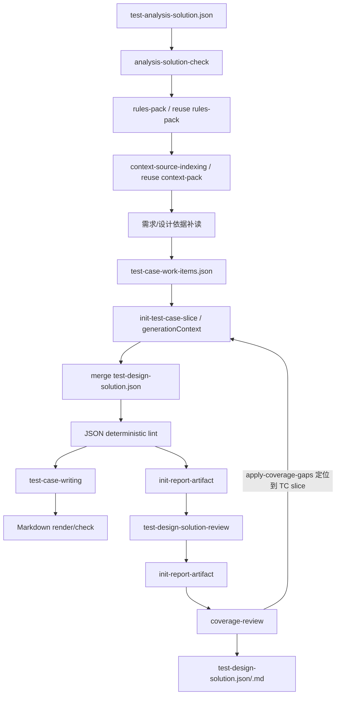

# Test Design Agent 设计

`test-design-agent` 承接已评审 `测试分析方案`，输出 `SC 场景树 -> TP 测试点 -> TC 测试用例` 的测试设计方案。

## 边界

设计阶段继承分析方案中已冻结的 `SC-*` 和 `TP-*`，不新增、删除、合并或改写分析层级。它按每个测试点生成 `process/test-case-slices/<TP-ID>.json`，评审后合并为完整步骤级 `TC-*`。

## 流程

## 输出结构

每个 TC 包含：

- `id`
- `title`
- `level`
- `preconditions[]`
- `testData[]`
- `steps[]`
- `expectedResult`
- `sourceRefs[]`

`level` 使用 `Level 0` 到 `Level 4`；`testData[]` 使用 `{name, value, description}`；`steps[]` 使用 `{stepNo, action, expected}`。

`steps[].action` 只写可执行动作或取数动作；字段、状态、记录、事件、响应内容等检查要求写入对应 `steps[].expected`，不要把检查项、断言项或观察结论单独写成步骤。

## 约束

- `TC-*` 全局连续编号。
- 每个 `TP-*` 至少生成 1 个 TC。
- 接口类 TC 不写完整裸 URL。
- 不输出自动化脚本或真实生产数据。
- 依据不足时使用输入可支撑的保守预期，不补写未说明具体值。
- `process/rules-pack.json` 独立索引强制规则；后续阶段按 `ruleSources[]` 读取适用规则正文。`process/context-pack.json` 只索引 project/personal knowledge 和 memory 动态来源。
- `generationContext` 由固定脚本写入 TC slice 和 review/coverage JSON，只作为生成前工作包，不合并进最终交付件。

## Coverage 返工闭环

`coverage-review` 是最终全局门禁。若 `reports/design-coverage-review.json` 输出 `blockingIssues[]` 或 `coverageGaps[]`，必须通过 `coverageGaps[].artifactLocation` 定位到对应 `process/test-case-slices/<TP-ID>.json`，先运行 `bin/apply-coverage-gaps.py` 重开工作项后再修复。

修复后重新执行：TC 切片 review -> `bin/merge-test-case-slice.py` -> deterministic lint/render -> 最终设计 review -> coverage-review -> `bin/check-artifact-consistency.py`。

不得直接编辑最终 Markdown，也不得绕过切片回写直接手改 `deliverables/test-design-solution.json`。

## 校验

- `python bin/lint-run-json.py outputs/runs/<run-id>`
- `python bin/render-run-markdown.py outputs/runs/<run-id> --check`
- `python bin/lint-test-design-solution.py outputs/runs/<run-id>/deliverables/test-design-solution.md`
- `python bin/check-artifact-consistency.py outputs/runs/<run-id>`
