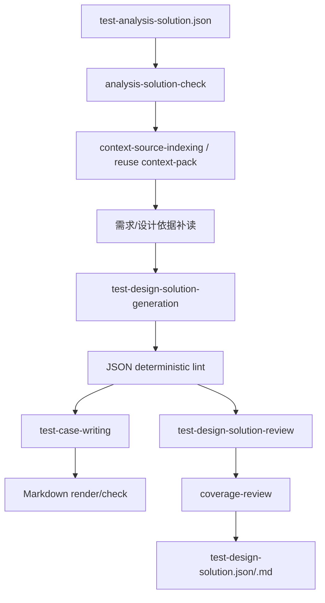

# Test Design Agent 设计

`test-design-agent` 承接已评审 `测试分析方案`，输出 `SC 场景树 -> TP 测试点 -> TC 测试用例` 的测试设计方案。

## 边界

设计阶段继承分析方案中的 `SC-*` 和 `TP-*`，不新增、删除、合并或改写分析层级。它只在每个测试点下生成完整步骤级 `TC-*`。

## 流程

## 输出结构

每个 TC 包含：

- `id`
- `title`
- `preconditions[]`
- `testData[]`
- `steps[]`
- `expectedResult`
- `sourceRefs[]`

`testData[]` 使用 `{name, value, description}`；`steps[]` 使用 `{stepNo, action, expected}`。

## 约束

- `TC-*` 全局连续编号。
- 每个 `TP-*` 至少生成 1 个 TC。
- 接口类 TC 不写完整裸 URL。
- 不输出自动化脚本或真实生产数据。
- 依据不足时使用输入可支撑的保守预期，不补写未说明具体值。

## 校验

- `python bin/lint-run-json.py outputs/runs/<run-id>`
- `python bin/render-run-markdown.py outputs/runs/<run-id> --check`
- `python bin/lint-test-design-solution.py outputs/runs/<run-id>/deliverables/test-design-solution.md`
- `python bin/check-artifact-consistency.py outputs/runs/<run-id>`
