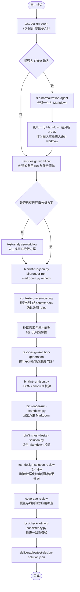

# Test Design Agent 设计文档

## 目标

`test-design-agent` 承接已评审 `测试分析方案`，输出 `测试设计方案`。它回答 how to test：每个普通测试点明细或失败类型明细应该使用哪些代表性条件、具体数据值、数据槽位、状态、接口返回或组合覆盖；预期结果保留在普通测试点明细或失败类型明细层，不在 `TDI-*` 下重复输出。若输入的需求、设计依据或外部分析方案是 `.docx` / `.xlsx`，先由 `@file-normalization-agent` 归一化为 Markdown，再把归一化 Markdown 路径交给设计链路。

主交付件不生成完整测试用例，不输出前置步骤、测试步骤、自动化脚本或执行数据清单。

## 主交付件

固定路径：

```text
outputs/runs/<run-id>/deliverables/test-design-solution.json
```

测试设计阶段优先复用上游测试分析方案所在 run；需要新建 run 时，`run-id` 固定使用 `python bin/generate-run-id.py` 生成，格式为 `<YYYYMMDD-HHMMSS>`。

固定术语与缩写：

| 中文术语 | 缩写/ID |
|---|---|
| 测试场景 | `SC-*` |
| 测试点 | `TP-*` |
| 测试点明细 | `TP-*-*` |
| 失败类型明细 | `TP-*-*-*` |
| 测试设计项 | `TDI-*` |

主交付件不展开英文全名，不使用 `TD-*`、`TC-*`、`TCT-*`、`TI-*`、`ITP-*` 或 `ITDI-*`。

## 输出样例

```json
{
  "artifactType": "test-design-solution",
  "schemaVersion": "1.0",
  "title": "订单下发 测试设计方案",
  "inputs": [
    {"field": "测试分析方案来源", "content": "deliverables/test-analysis-solution.json"}
  ],
  "scenarios": [
    {
      "id": "SC-001",
      "title": "订单下发",
      "testPoints": [
        {
          "id": "TP-001",
          "title": "E2E场景测试",
          "details": [
            {
              "id": "TP-001-001",
              "title": "订单下发主流程成功闭环",
              "description": "验证订单下发场景的端到端主流程能够从请求接收到订单处理结果完成闭环。",
              "expectedResult": "订单下发成功",
              "failureDetails": [],
              "designItems": [
                {
                  "id": "TDI-001",
                  "content": "渠道=API；订单ID=ORD20260528001；用户状态=正常；商品状态=可售；库存数量=10；提交数量=1"
                }
              ]
            }
          ]
        }
      ]
    }
  ]
}
```

## 主运行流程



## Skill 分工

| 层级 | Skill | 职责 |
|---|---|---|
| Agent 门面 | `test-design-agent` | 识别用户意图，路由设计生成、评审、记录和框架维护任务 |
| 文件归一化入口 | `file-normalization-agent` | 将 `.docx` / `.xlsx` 输入归一化为 Markdown；不进入测试设计主流程 |
| 主入口 | `test-design-workflow` | 固定根目录、复用或创建 run、编排设计链路、输出主交付件 |
| 上下文 | `context-source-indexing` | 索引 project/personal 动态来源 frontmatter，记录绑定状态和阶段可见性 |
| 设计生成 | `test-design-solution-generation` | 在普通 `TP-*-*` 或失败类型 `TP-*-*-*` 下保留预期结果，并生成数据化 `TDI-*` |
| 确定性校验 | `bin/lint-run-json.py`、`bin/render-run-markdown.py --check`、`bin/lint-test-design-solution.py` | 先检查 JSON canonical 结构、编号和字段，再检查派生 Markdown 渲染一致性与人读格式；失败时修正 JSON，不手工改 Markdown |
| 独立评审 | `test-design-solution-review` | 检查承接关系、设计项数据化粒度、叶子节点预期结果依据和非完整用例化语义 |
| 覆盖审查 | `coverage-review` | 检查需求覆盖、分析方案承接、rules 应用、动态来源应用和覆盖门禁；不重复 lint 已覆盖的结构规则 |
| 输出收口 | `bin/check-artifact-consistency.py` | 检查 run 目录、三组固定 process 产物、任务清单状态和主交付件基础一致性 |

## 分析输入质量处理

测试设计阶段以已评审测试分析方案为主账本，不重新生成或静默改写分析层级。

- 如果输入分析方案 JSON 未通过 `bin/lint-run-json.py` 或渲染后的分析方案未通过 `bin/render-run-markdown.py --check` / `bin/lint-test-analysis-solution.py`，不进入测试设计生成；迁移期只提供旧 Markdown 时，先转换为临时 JSON 再校验。
- 如果设计阶段发现分析方案缺少接口归属、E2E 误挂分支、第四层拆分不合理或测试点明细已经下钻成具体数据值，记录为输入质量问题。
- 能在设计层纠偏的内容只限于把已存在叶子分析节点扩展为 `TDI-*`；需要新增、删除、合并或改写 `SC-*`、`TP-*`、`TP-*-*`、`TP-*-*-*` 时，应回到 `@test-analysis-agent` 修正。
- 单一弱结果分支如果在分析方案中停留在 `TP-*-*`，设计阶段直接在该明细下生成 `TDI-*`，不机械要求新增第四层。

## Knowledge 分工

| 路径 | 作用 |
|---|---|
| `knowledge/test-workflow-boundaries.md` | 定义测试分析、测试设计、测试技术之间的边界 |
| `knowledge/test-analysis-solution-standard.md` | 定义上游分析方案结构和设计承接边界 |
| `knowledge/test-design-solution-standard.md` | 定义设计方案结构、字段、粒度和兜底规则 |
| `knowledge/test-techniques/` | 测试技术库，支持把测试点明细扩展为代表性条件、数据、状态或组合 |
| `skills/coverage-review/references/coverage-check.md` | coverage-review 私有覆盖门禁参考 |

## Rules 分工

`rules/` 保存强制规则，优先级低于当前用户明确指令，但高于测试分析方案、需求文档、设计方案、memory 和 knowledge。

| 路径 | 作用 |
|---|---|
| `rules/*.md` | 全局强制规则 |
| `rules/projects/<project-key>/**/*.md` | 项目级强制规则，确定 `project-key` 后读取 |
| `rules/user/**/*.md` | 个人本地强制规则，不得覆盖 core/project rules |

设计阶段必须复用或生成 `process/context-pack.json`，确认 `projectBinding`、`personalBinding` 和对设计阶段可见的动态来源。core rules 由 workflow 或对应 skill 固定读取，并在 TDI 生成、评审或覆盖审查中应用或解释。

## 动态来源应用

project/personal 动态来源只来自 `rules/projects/<project-key>/`、`rules/user/`、`knowledge/projects/<project-key>/`、`knowledge/user/`、`memory/projects/<project-key>/` 和 `memory/user/`。文件名没有硬性要求，但必须声明 `name`、`description`，可选 `stages`。context pack 阶段只索引 frontmatter，不提前判断具体测试设计项命中。

- 测试设计因子库、业务测试设计模式库和测试 Oracle 可通过 `stages` 对 `test-design-solution-generation` 可见，用于生成代表性条件、具体数据值、数据槽位、状态、组合和预期结果依据。
- 测试设计 checklist 通常配置为 `coverage-review` 可见，统一查漏。
- 覆盖门禁本身维护在 `skills/coverage-review/references/coverage-check.md`，不再维护独立顶层质量门禁目录；project/personal 附加要求应按语义进入 rules、knowledge 或 memory。
- 阶段读取动态来源后必须输出应用状态。
- 应用状态只能使用 `applied`、`not_applicable`、`insufficient_evidence`、`conflict_with_requirement` 或 `deferred_to_review`。

## 校验与审查门禁

确定性结构、编号、字段、JSON canonical 结构、Markdown 渲染一致性和固定章节问题以 `bin/lint-run-json.py`、`bin/render-run-markdown.py --check`、`bin/lint-test-design-solution.py` 和 `bin/check-artifact-consistency.py` 为事实源；模型型 review 不重复逐项检查，只消费脚本结果并继续做语义和覆盖判断。覆盖审查使用 `skills/coverage-review/references/coverage-check.md` 和 coverage-review 私有 references，不读取独立顶层质量门禁目录。

- 主输出普通分支必须按 `测试场景 -> 测试点 -> 测试点明细 -> 测试设计项` 组织；非成功分支必须按 `测试场景 -> 测试点 -> 测试点明细 -> 失败类型明细 -> 测试设计项` 组织。
- 每个普通测试点明细或失败类型明细至少有一个 `TDI-*`。
- `E2E场景测试` 是独立同级测试点，只维护端到端主流程成功闭环设计项；其他规则、异常、接口、权限、状态、回滚或补偿设计项必须保留在同级 `TP-*` 下。
- 如果分析方案包含接口测试或集成覆盖场景，设计方案必须继承“先接口/端点/集成点，再契约维度，再 TDI”的结构，不把多个接口的设计项混到泛化测试点下。
- 分析方案已有 `TP-*-*-*` 时，设计方案必须完整继承，不得合并回 `TP-*-*`。
- 分析方案中的单一弱结果分支停留在 `TP-*-*` 时，设计方案直接在该明细下生成 `TDI-*`，不机械新增第四层。
- 设计方案不得新增、删除、合并或改写分析层级；发现分析层级缺口时记录输入质量问题，必要时回到测试分析阶段修正。
- 普通测试点明细或失败类型明细层保留 `expectedResult`。
- 测试设计项固定写入 `designItems[]`，每项包含 `id` 和 `content`；不得在 `designItems[].content` 中重复写预期结果；主输出不得使用测试设计项表格。
- `TDI-*` 应优先写具体数据值、数据槽位、状态值、接口返回或组合，例如 `amount=1000.00；category=PAY；customer_id=AGT_CUSTOMER_001`。
- 接口类 `TDI-*` 不得写完整裸 URL；必须拆成 `接口=METHOD /path`、`参数名=参数值`、`响应状态=...` 等同一行字段片段，避免 Markdown 转脑图时被链接解析或换行破坏层级。
- `TDI-*` 不得写结果或动作表达，例如“发送通知”“显示提示”“自动填充”“接口调用正确”“处理成功”“删除成功”；这些语义属于测试点详情或预期结果。
- 同类条件在不同场景、渠道、操作或接口下复用时，`TDI-*` 必须补充差异维度，例如 `场景=`、`渠道=`、`操作=`、`接口=` 或 `数据依赖=`；无差异重复项应合并。
- 接口契约叶子节点应基于输入已明确字段约束覆盖有效、无效、边界、枚举、必填、鉴权、幂等、超时或异常返回组合，不只生成正向有效组合。
- 超时、回滚、补偿或外部依赖恢复类叶子节点应写成可观察条件组合，例如查询返回数量、状态值、依赖返回或超时状态。
- 主输出不得出现完整测试用例字段、操作步骤、脚本或执行数据。
- 主输出不得使用 Markdown 加粗语法，例如 `**文本**` 或 `__文本__`。
- 依据不足的预期结果只写输入可支撑的保守判定，不补写未说明具体值。
- 适用 rules 必须被执行、解释不适用，或记录被当前用户明确指令覆盖。

## 校验命令

```bash
python bin/sync-opencode-skills.py --check
python bin/validate-agent-runtime.py
python bin/lint-run-json.py outputs/runs/<run-id>
python bin/render-run-markdown.py outputs/runs/<run-id> --check
python bin/lint-test-design-solution.py outputs/runs/<run-id>/deliverables/test-design-solution.md
python bin/check-artifact-consistency.py outputs/runs/<run-id>
```

`python bin/smoke-test-analysis.py` 只用于框架回归或示例 fixture 变更后的 smoke 检查，不属于单次测试设计方案 review 阶段。
