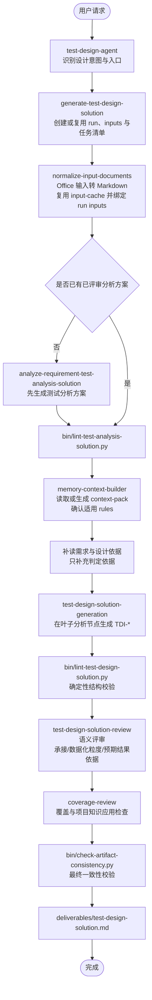

# Test Design Agent 设计文档

## 目标

`test-design-agent` 承接已评审 `测试分析方案`，输出 `测试设计方案`。它回答 how to test：每个普通测试点明细或失败类型明细应该使用哪些代表性条件、具体数据值、数据槽位、状态、接口返回或组合覆盖；预期结果保留在普通测试点明细或失败类型明细层，不在 `TDI-*` 下重复输出。若输入的需求、设计依据或外部分析方案是 `.docx` / `.xlsx`，先复用或创建 run，再归一化为 Markdown 并绑定到该 run 的 `inputs/` 目录后进入设计链路。

主交付件不生成完整测试用例，不输出前置步骤、测试步骤、自动化脚本或执行数据清单。

## 主交付件

固定路径：

```text
outputs/runs/<run-id>/deliverables/test-design-solution.md
```

测试设计阶段优先复用上游测试分析方案所在 run；需要新建 run 时，`run-id` 固定使用 `python bin/generate-run-id.py` 生成，格式为 `<YYYYMMDD-HHMMSS>`。

固定术语与缩写：

| 中文术语 | 缩写/ID |
|---|---|
| 测试场景 | `SC-*` |
| 测试点 | `TP-*` |
| 测试点明细 | `TP-*-*` |
| 失败类型明细 | `TP-*-*-*` |
| 测试设计项 | `TDI-*` |

主交付件不展开英文全名，不使用 `TD-*`、`TC-*`、`TCT-*`、`TI-*`、`ITP-*` 或 `ITDI-*`。

## 输出样例

```markdown
# 订单下发 测试设计方案

## 1. 设计输入

## 2. 测试场景与测试设计

### SC-001 订单下发

#### TP-001 E2E场景测试

##### TP-001-001 订单下发主流程成功闭环

- 测试点详情：验证订单下发场景的端到端主流程能够从请求接收到订单处理结果完成闭环。

- 预期结果：订单下发成功

- TDI-001 渠道=API；订单ID=ORD20260528001；用户状态=正常；商品状态=可售；库存数量=10；提交数量=1

#### TP-002 验证下发订单 ID 长度规则

##### TP-002-001 下发订单 ID 满足长度要求

- 测试点详情：验证下发订单 ID 符合需求定义的长度规则时，系统能够正常识别并处理订单下发请求。

- 预期结果：下发成功

- TDI-002 orderId=ORD2026052801；总长度=13位

##### TP-002-002 下发订单 ID 不满足长度要求

###### TP-002-002-001 下发订单 ID 长度小于规则要求

- 测试点详情：验证下发订单 ID 长度短于需求定义的长度规则时，系统能够识别为无效订单 ID 并拒绝处理订单下发请求。

- 预期结果：待人工分析确认

- TDI-003 orderId=ORD202605280；总长度=12位

###### TP-002-002-002 下发订单 ID 长度大于规则要求

- 测试点详情：验证下发订单 ID 长度长于需求定义的长度规则时，系统能够识别为无效订单 ID 并拒绝处理订单下发请求。

- 预期结果：待人工分析确认

- TDI-004 orderId=ORD20260528001；总长度=14位
```

## 主运行流程



## Skill 分工

| 层级 | Skill | 职责 |
|---|---|---|
| Agent 门面 | `test-design-agent` | 识别用户意图，路由设计生成、评审、记录和框架维护任务 |
| 输入归一化 | `normalize-input-documents` | 将 `.docx` / `.xlsx` 需求、设计依据或外部分析方案转换到全局 cache，并绑定为 run-local Markdown，后续流程只读取 `outputs/runs/<run-id>/inputs/` |
| 主入口 | `generate-test-design-solution` | 固定根目录、复用或创建 run、编排设计链路、输出主交付件 |
| 设计生成 | `test-design-solution-generation` | 在普通 `TP-*-*` 或失败类型 `TP-*-*-*` 下保留预期结果，并生成数据化 `TDI-*` |
| 确定性校验 | `bin/lint-test-design-solution.py` | 检查结构、编号、字段、Markdown 语法和禁用术语；失败时不进入模型评审 |
| 独立评审 | `test-design-solution-review` | 检查承接关系、设计项数据化粒度、叶子节点预期结果依据和非完整用例化语义 |
| 覆盖审查 | `coverage-review` | 检查需求覆盖、分析方案承接、rules 应用、项目知识应用和质量门禁；不重复 lint 已覆盖的结构规则 |
| 输出收口 | `bin/check-artifact-consistency.py` | 检查 run 目录、三个固定 process 产物、任务清单状态和主交付件基础一致性 |

## 分析输入质量处理

测试设计阶段以已评审测试分析方案为主账本，不重新生成或静默改写分析层级。

- 如果输入分析方案未通过 `bin/lint-test-analysis-solution.py`，不进入测试设计生成。
- 如果设计阶段发现分析方案缺少接口归属、E2E 误挂分支、第四层拆分不合理或测试点明细已经下钻成具体数据值，记录为输入质量问题。
- 能在设计层纠偏的内容只限于把已存在叶子分析节点扩展为 `TDI-*`；需要新增、删除、合并或改写 `SC-*`、`TP-*`、`TP-*-*`、`TP-*-*-*` 时，应回到 `@test-analysis-agent` 修正。
- 单一弱结果分支如果在分析方案中停留在 `TP-*-*`，设计阶段直接在该明细下生成 `TDI-*`，不机械要求新增第四层。

## Knowledge 分工

| 路径 | 作用 |
|---|---|
| `knowledge/test-analysis-methodology.md` | 定义测试分析、测试设计、测试技术之间的边界 |
| `knowledge/test-analysis-solution-standard.md` | 定义上游分析方案结构和设计承接边界 |
| `knowledge/test-design-solution-standard.md` | 定义设计方案结构、字段、粒度和兜底规则 |
| `knowledge/test-techniques/` | 测试技术库，支持把测试点明细扩展为代表性条件、数据、状态或组合 |

## Rules 分工

`rules/` 保存强制规则，优先级低于当前用户明确指令，但高于测试分析方案、需求文档、设计方案、memory 和 knowledge。

| 路径 | 作用 |
|---|---|
| `rules/*.md` | 全局强制规则 |
| `rules/projects/<project-key>/**/*.md` | 项目级强制规则，确定 `project-key` 后读取 |
| `rules/user/**/*.md` | 个人本地强制规则，不得覆盖 core/project rules |

设计阶段必须复用或生成 `process/context-pack.md`，确认适用 rules 和 Rules 与输入冲突记录；被登记的 rules 必须在 TDI 生成、评审或覆盖审查中应用或解释。

## Project Knowledge 应用

`knowledge/projects/<project-key>/` 下的文件名没有硬性要求。context pack 阶段只判断文件用途和强制应用环节，不提前判断具体测试设计项命中。

- 测试设计因子库、业务测试设计模式库和测试 Oracle 可绑定到 `test-design-solution-generation`，用于生成代表性条件、具体数据值、数据槽位、状态、组合和预期结果依据。
- 测试设计 checklist 默认绑定到 `coverage-review` 统一查漏；只有文件或用户指令明确要求产物语义评审时，才额外绑定到 `test-design-solution-review`。
- 被绑定到某阶段的 project knowledge，该阶段必须读取相关章节并输出应用状态。
- 应用状态只能使用 `applied`、`not_applicable`、`insufficient_evidence`、`conflict_with_requirement` 或 `deferred_to_review`。

## 质量门禁

- 主输出普通分支必须按 `测试场景 -> 测试点 -> 测试点明细 -> 测试设计项` 组织；非成功分支必须按 `测试场景 -> 测试点 -> 测试点明细 -> 失败类型明细 -> 测试设计项` 组织。
- 每个普通测试点明细或失败类型明细至少有一个 `TDI-*`。
- `E2E场景测试` 是独立同级测试点，只维护端到端主流程成功闭环设计项；其他规则、异常、接口、权限、状态、回滚或补偿设计项必须保留在同级 `TP-*` 下。
- 如果分析方案包含接口测试或集成覆盖场景，设计方案必须继承“先接口/端点/集成点，再契约维度，再 TDI”的结构，不把多个接口的设计项混到泛化测试点下。
- 分析方案已有 `TP-*-*-*` 时，设计方案必须完整继承，不得合并回 `TP-*-*`。
- 分析方案中的单一弱结果分支停留在 `TP-*-*` 时，设计方案直接在该明细下生成 `TDI-*`，不机械新增第四层。
- 设计方案不得新增、删除、合并或改写分析层级；发现分析层级缺口时记录输入质量问题，必要时回到测试分析阶段修正。
- 普通测试点明细或失败类型明细层保留一条 `- 预期结果：...`。
- 测试设计项固定使用列表节点：`- TDI-001 <条件/数据/状态/组合>`，不得在 TDI 下一层重复写预期结果；主输出不得使用测试设计项表格。
- `TDI-*` 应优先写具体数据值、数据槽位、状态值、接口返回或组合，例如 `amount=1000.00；category=PAY；customer_id=AGT_CUSTOMER_001`。
- 主输出不得出现完整测试用例字段、操作步骤、脚本或执行数据。
- 主输出不得使用 Markdown 加粗语法，例如 `**文本**` 或 `__文本__`。
- 依据不足的预期结果必须写 `待人工分析确认`。
- 适用 rules 必须被执行、解释不适用，或记录被当前用户明确指令覆盖。

## 校验命令

```bash
python bin/sync-opencode-skills.py --check
python bin/validate-agent-runtime.py
python bin/lint-test-design-solution.py outputs/runs/<run-id>/deliverables/test-design-solution.md
python bin/check-artifact-consistency.py outputs/runs/<run-id>
```

`python bin/smoke-test-analysis.py` 只用于框架回归或示例 fixture 变更后的 smoke 检查，不属于单次测试设计方案 review 阶段。
