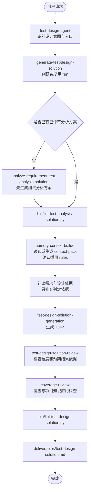

# Test Design Agent 设计文档

## 目标

`test-design-agent` 承接已评审 `测试分析方案`，输出 `测试设计方案`。它回答 how to test：每个测试点明细应该使用哪些代表性条件、数据、状态或组合覆盖，并给出需求或设计方案可确认的预期结果。

主交付件不生成完整测试用例，不输出前置步骤、测试步骤、自动化脚本或执行数据清单。

## 主交付件

固定路径：

```text
outputs/runs/<run-id>/deliverables/test-design-solution.md
```

测试设计阶段优先复用上游测试分析方案所在 run；需要新建 run 时，`run-id` 固定使用 `python bin/generate-run-id.py` 生成，格式为 `<YYYYMMDD-HHMMSS>`。

固定术语与缩写：

| 中文术语 | 缩写/ID |
|---|---|
| 测试场景 | `SC-*` |
| 测试点 | `TP-*` |
| 测试点明细 | `TP-*-*` |
| 测试设计项 | `TDI-*` |

主交付件不展开英文全名，不使用 `TD-*`、`TC-*`、`TCT-*`、`TI-*`、`ITP-*` 或 `ITDI-*`。

## 输出样例

```markdown
# 订单下发 测试设计方案

## 1. 设计输入

## 2. 测试场景与测试设计

### SC-001 订单下发

#### TP-001 验证下发订单 ID 长度规则

##### TP-001-001 下发订单 ID 满足长度要求

- 测试点详情：验证下发订单 ID 符合需求定义的长度规则时，系统能够正常识别并处理订单下发请求。

| 测试设计项 ID | 条件/数据/状态/组合 | 预期结果 |
|---|---|---|
| TDI-001 | 下发订单 ID 总长度等于 13 位 | 下发成功 |

##### TP-001-002 下发订单 ID 不满足长度要求

- 测试点详情：验证下发订单 ID 不符合需求定义的长度规则时，系统能够拦截或拒绝订单下发请求。

| 测试设计项 ID | 条件/数据/状态/组合 | 预期结果 |
|---|---|---|
| TDI-002 | 下发订单 ID 总长度小于 13 位 | 待人工分析确认 |
| TDI-003 | 下发订单 ID 总长度大于 13 位 | 待人工分析确认 |
```

## 主运行流程



## Skill 分工

| 层级 | Skill | 职责 |
|---|---|---|
| Agent 门面 | `test-design-agent` | 识别用户意图，路由设计生成、评审、记录和框架维护任务 |
| 主入口 | `generate-test-design-solution` | 固定根目录、复用或创建 run、编排设计链路、输出主交付件 |
| 设计生成 | `test-design-solution-generation` | 在 `TP-*-*` 下生成 `TDI-*` 和预期结果 |
| 独立评审 | `test-design-solution-review` | 检查承接关系、设计项粒度、预期结果依据、旧字段和非完整用例化 |
| 覆盖审查 | `coverage-review` | 检查需求覆盖、分析方案承接、rules 应用、项目知识应用和质量门禁 |

## Knowledge 分工

| 路径 | 作用 |
|---|---|
| `knowledge/test-analysis-methodology.md` | 定义测试分析、测试设计、测试技术之间的边界 |
| `knowledge/test-analysis-solution-standard.md` | 定义上游分析方案结构和设计承接边界 |
| `knowledge/test-design-solution-standard.md` | 定义设计方案结构、字段、粒度和兜底规则 |
| `knowledge/test-techniques/` | 测试技术库，支持把测试点明细扩展为代表性条件、数据、状态或组合 |

## Rules 分工

`rules/` 保存强制规则，优先级低于当前用户明确指令，但高于测试分析方案、需求文档、设计方案、memory 和 knowledge。

| 路径 | 作用 |
|---|---|
| `rules/*.md` | 全局强制规则 |
| `rules/projects/<project-key>/**/*.md` | 项目级强制规则，确定 `project-key` 后读取 |
| `rules/user/**/*.md` | 个人本地强制规则，不得覆盖 core/project rules |

设计阶段必须复用或生成 `process/context-pack.md`，确认适用 rules 和 Rules 与输入冲突记录；被登记的 rules 必须在 TDI 生成、评审或覆盖审查中应用或解释。

## 质量门禁

- 主输出必须按 `测试场景 -> 测试点 -> 测试点明细 -> 测试设计项` 组织。
- 每个测试点明细至少有一个 `TDI-*`。
- 测试设计项表头固定为 `测试设计项 ID | 条件/数据/状态/组合 | 预期结果`。
- 主输出不得出现完整测试用例字段、操作步骤、脚本或执行数据。
- 依据不足的预期结果必须写 `待人工分析确认`。
- 适用 rules 必须被执行、解释不适用，或记录被当前用户明确指令覆盖。

## 校验命令

```bash
python bin/sync-opencode-skills.py --check
python bin/validate-agent-runtime.py
python bin/lint-test-design-solution.py outputs/runs/<run-id>/deliverables/test-design-solution.md
```

`python bin/smoke-test-analysis.py` 只用于框架回归或示例 fixture 变更后的 smoke 检查，不属于单次测试设计方案 review 阶段。
