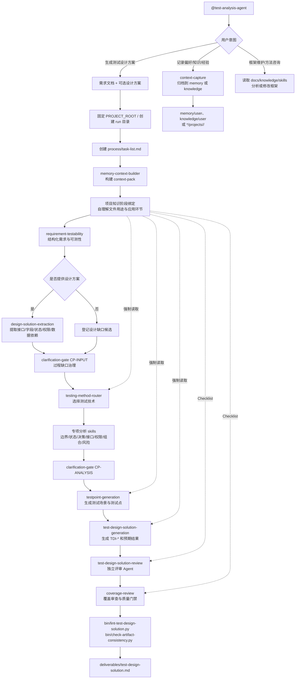

# Test Design Solution Agent 设计文档

## 1. 目标

本 Agent 面向 Markdown 需求文档和可选设计方案文档，输出 `测试设计方案`。它是独立项目，所有运行入口、Agent 门面、知识库、模板、质量门禁和校验脚本都在本仓库内维护，不依赖其他 Agent 项目或外部仓库结构。

主输出粒度为：

```text
测试场景 -> 测试点 -> 测试设计项
```

`测试点` 属于测试分析层，回答 what to test。`测试设计项` 属于测试设计层，回答 how to test this point，即用哪些代表性条件、数据、状态或组合覆盖测试点。主交付件不输出完整测试用例、前置步骤、测试步骤、自动化脚本或执行数据清单。

## 2. 产物形态

主交付件固定为：

```text
outputs/runs/<run-id>/deliverables/test-design-solution.md
```

术语与缩写固定为：测试场景 `SC-*`、测试点 `TP-*`、测试设计项 `TDI-*`。主交付件只使用中文术语和缩写，不展开英文全名，不使用其他编号体系。

核心结构：

```markdown
# <需求名称> 测试设计方案

## 1. 需求范围

## 2. 测试场景与测试设计

### 场景 SC-001：订单下发

#### 测试点 TP-001：验证下发订单 ID 长度规则

| 测试设计项 ID | 测试设计项 | 预期结果 |
|---|---|---|
| TDI-001 | 下发订单 ID 总长度为 13 位 | 订单下发成功 |
| TDI-002 | 下发订单 ID 总长度为 10 位 | 待人工分析确认 |
```

预期结果规则：

- 有明确需求/设计依据时，写简短预期结果。
- 如果需求和设计方案没有说明错误提示、状态变化、错误码、接口返回内容、消息发送结果或数据记录变化，写 `待人工分析确认`。
- 不设置 `## 3. 未明确规则`。
- 不设置独立待确认信息清单。

## 3. 架构



## 4. Skill 分层

| 层级 | Skill | 职责 |
|---|---|---|
| Agent 门面 | `agents/test-analysis-agent.md` | 支持 `@test-analysis-agent`，识别用户意图并路由到主流程、上下文归档或框架维护 |
| 主入口 | `analyze-requirement-test-design-solution` | 固定根目录、创建 run、编排全链路、输出主交付件 |
| 上下文归档 | `context-capture` | 判断用户要求记录的内容应进入 `memory` 还是 `knowledge`，以及 personal/project 层级 |
| 上下文 | `memory-context-builder` | 收集 core/project/personal 上下文，生成 context pack 和项目知识阶段绑定 |
| 需求分析 | `requirement-testability` | 结构化需求、识别可测性缺口 |
| 设计提取 | `design-solution-extraction` | 提取接口、字段、状态、权限、数据依赖和设计缺口 |
| 缺口治理 | `clarification-gate` | 过程级候选治理，不写主交付件待确认章节 |
| 方法路由 | `testing-method-router` | 选择适用测试技术和专项分析 skill |
| 专项分析 | selected method skills | 产生方法证据和测试点候选 |
| 测试分析 | `testpoint-generation` | 生成测试场景和测试点 |
| 测试设计 | `test-design-solution-generation` | 生成测试设计项和预期结果 |
| 独立评审 | `test-design-solution-review` | 检查设计项粒度、预期结果依据和旧字段泄漏 |
| 覆盖审查 | `coverage-review` | 执行门禁、lint 和一致性检查 |

## 5. Knowledge 边界

| 知识 | 用途 |
|---|---|
| `knowledge/test-analysis-methodology.md` | 定义 Test Analysis / Test Design / Test Technique 边界 |
| `knowledge/test-design-solution-standard.md` | 定义主交付件结构、字段和兜底规则 |
| `knowledge/testpoint-standard.md` | 定义测试点粒度与非用例化边界 |
| `knowledge/test-techniques/` | 提供测试技术，用于分析测试点和设计代表性条件/数据/状态/组合 |
| `knowledge/projects/<project-key>/**/*.md` | 项目级测试知识补充；文件名不作硬性要求，由 context pack 自理解识别用途并绑定到后续环节 |

`test-techniques` 不直接等同输出格式。它们支持测试分析层识别 what to test，也支持测试设计层选择 how to cover。

长期上下文归档边界：

- `memory/` 保存会变化的事实、偏好、历史经验和复盘结论。
- `knowledge/` 保存稳定的测试知识、测试设计模式、checklist、Oracle、路由说明和方法论补充。
- `memory/user/` 与 `knowledge/user/` 只表达 personal 层偏好和本地测试启发，不得写成项目事实。
- `memory/projects/<project-key>/` 与 `knowledge/projects/<project-key>/` 只在能唯一确定项目时写入。

Project knowledge 阶段绑定规则：

- context pack 只判断文件用途和强制应用环节，不提前判断具体测试点或测试设计项命中。
- 测试设计因子库、业务测试设计模式库可绑定到 `testing-method-router`、`testpoint-generation` 和 `test-design-solution-generation`。
- 测试设计 checklist 可绑定到 `test-design-solution-review` 和 `coverage-review`。
- 被绑定阶段必须读取对应文件并输出应用状态：`applied`、`not_applicable`、`insufficient_evidence`、`conflict_with_requirement` 或 `deferred_to_review`。

## 6. 质量门禁

核心门禁：

- 主输出必须按 `测试场景 -> 测试点 -> 测试设计项` 组织。
- 测试设计项表头必须是 `测试设计项 ID | 测试设计项 | 预期结果`。
- `TDI-*` 必须全局连续。
- 主输出不得出现旧版主交付件字段；字段禁用清单以 `bin/lint-test-design-solution.py` 为准。
- 主输出不得出现 `## 3. 未明确规则`。
- 预期结果不能为空；依据不足时必须写 `待人工分析确认`。
- 不得输出前置步骤、测试步骤、操作步骤、自动化脚本或接口调用代码。
- 如果 context pack 存在项目知识阶段绑定，对应阶段必须有应用状态；`project-knowledge-application-check.md` 负责校验。

校验命令：

```bash
python bin/validate-agent-runtime.py
python bin/sync-opencode-skills.py --check
python bin/lint-test-design-solution.py outputs/runs/<run-id>/deliverables/test-design-solution.md
python bin/check-artifact-consistency.py outputs/runs/<run-id>
python bin/smoke-test-analysis.py
```
