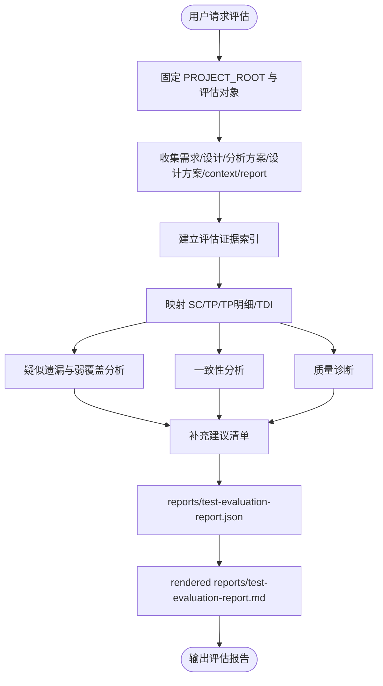

# Test Eval Agent 设计文档

## 状态

`test-eval-agent` 当前处于设计阶段，尚未实现。

本仓库暂不提供 `@test-eval-agent` 门面、eval skill、评估模板或运行时 wiring。本文只定义目标架构、职责边界、评估方法和后续实现建议，避免当前生成链路误认为已经存在可调用的评估 Agent。

## 目标

`test-eval-agent` 面向已生成或待评审的测试分析/测试设计产物，输出独立的质量诊断、疑似遗漏/弱覆盖分析、一致性分析和补充建议。它不负责生成主交付件，不替代 `test-analysis-agent` 或 `test-design-agent`。

它回答的问题是：

```text
这份测试分析/测试设计方案是否完整、一致、可继续使用？
有哪些疑似遗漏、弱覆盖或需要确认的补充点？
哪里冲突、错位或依据不足？
应该如何补充或修正？
```

## Agent 边界

| Agent | 主问题 | 主输入 | 主输出 | 是否生成主交付件 |
|---|---|---|---|---|
| `test-analysis-agent` | what to test | 需求文档、可选设计方案 | `test-analysis-solution.json` | 是 |
| `test-design-agent` | how to test | 已评审测试分析方案、可选需求/设计依据 | `test-design-solution.json` | 是 |
| `test-eval-agent` | good enough / suspected missing / inconsistent | 需求、设计、分析方案、设计方案、context pack 和可选报告证据 | 测试产物质量评估报告 | 否 |

`test-eval-agent` 默认不修改主交付件，不自动更新 memory、knowledge 或 rules。只有用户明确要求“按评估建议修复”“沉淀规则”“记录经验”时，才进入对应框架维护或长期上下文写入流程。

## 与现有 Review 的区别

现有 `test-analysis-solution-review` 和 `test-design-solution-review` 是生成链路内部的独立语义评审步骤，重点保证粒度、事实依据、承接关系和非用例化语义不跑偏。产物结构、编号、字段、JSON canonical 结构和派生 Markdown 语法由确定性 lint 脚本前置检查，不再交给模型评审重复判断。

`test-eval-agent` 是生成链路外部的质量诊断入口，重点发现疑似遗漏、弱覆盖、冲突、错位和系统性改进机会。它不声称自己产出的分析结论比生成 Agent 更正确，只输出基于证据索引和检查清单的风险提示。

| 能力 | Review Skill | Test Eval Agent |
|---|---|---|
| 所在位置 | 生成流程内部 | 独立入口，未来可作为可选 gate |
| 核心目标 | 结构合规、粒度正确、非用例化 | 覆盖风险可见、一致性可信、补充点可追溯 |
| 输出形态 | 评审结论、修正建议 | 质量评估报告、疑似遗漏/弱覆盖清单、一致性问题、补充建议 |
| 是否修改主产物 | 可在生成流程内推动修正 | 默认不修改 |
| 是否对比人工稿 | 不需要 | 不作为默认目标 |
| 框架反哺 | 间接 | 可输出规则、knowledge、skill 或 template 改进建议 |

## 输入范围

`test-eval-agent` 可以按可用性读取以下输入：

| 输入 | 必需性 | 用途 |
|---|---|---|
| 需求文档 | 推荐 | 建立评估证据索引和业务规则线索 |
| 设计方案文档 | 可选 | 补充接口、字段、状态、权限、数据依赖、异常处理和非功能指标 |
| `deliverables/test-analysis-solution.json` | 分析评估必需 | 评估 `SC-* / TP-* / TP-*-* / TP-*-*-*` 质量 |
| `deliverables/test-design-solution.json` | 设计评估必需 | 评估 `TDI-*` 的代表性条件、数据、状态或组合 |
| `process/context-pack.json` | 推荐 | 检查 rules、knowledge、memory 中的 project/personal 动态来源是否被正确应用 |
| `reports/*.json` | 可选 | 补充方法证据、评审结论和覆盖审查结果；同名 Markdown 仅作为人读版 |

缺少某类输入时，不阻断评估；评估报告应明确“未评估范围”和“不确定性”。

输入一致性原则：

- 如果测试分析或测试设计生成阶段传入过设计方案文档，Eval 阶段也应传入同一设计方案文档，或传入能等价承接设计事实的报告证据。
- 如果 Eval 阶段缺少生成时使用过的设计方案，只能做降级评估：不得断言设计依据遗漏，只能标记为“设计依据未输入导致无法确认”。
- 如果生成阶段使用了 `project-key`、core rules、project/personal 动态来源，Eval 阶段应传入对应 `process/context-pack.json`，否则动态来源应用检查只能标记为未评估。
- Eval 阶段不得绕过 `context-pack.json` 全目录搜索 project/personal 内容；只评估 `sources[]` 中对相关阶段可见并被读取或应读取的动态来源。

## 输出定位

未来实现后，评估报告建议写入 JSON canonical，并按需渲染 Markdown 人读版：

```text
outputs/runs/<run-id>/reports/test-evaluation-report.json
outputs/runs/<run-id>/reports/test-evaluation-report.md
```

如果评估外部文件或多个 run，可以新建评估 run：

```text
outputs/runs/<run-id>/reports/test-evaluation-report.json
outputs/runs/<run-id>/reports/test-evaluation-report.md
```

报告不应写入 `deliverables/`，避免被误认为主交付件。

## JSON 输出结构建议

```json
{
  "artifactType": "test-evaluation-report",
  "schemaVersion": "1.0",
  "summary": {
    "evaluatedArtifacts": [],
    "nextStageRecommendation": "yes/no/conditional",
    "mainRisks": [],
    "recommendedActions": []
  },
  "missingOrWeakCoverage": [],
  "consistencyIssues": [],
  "qualityFindings": [],
  "recommendations": [],
  "contextApplicationChecks": [],
  "nextStageChecks": []
}
```

Markdown 报告只作为渲染样式，不由模型直接维护；如果 JSON 与 Markdown 不一致，以 JSON 为准重新渲染。

## 评估能力模型

### 1. 评估证据索引

`test-eval-agent` 不重新生成一份“标准测试分析方案”，也不把自己的分析结果当作标准答案。它先从需求、设计、core rules、`process/context-pack.json` 中可见且被读取或应读取的动态来源，以及可选报告证据中抽取可追踪的评估证据索引，再检查当前测试分析/测试设计产物是否显式承接、弱承接、冲突承接或未承接这些证据线索。

评估证据索引可以包括：

- 业务目标和验收标准。
- 用户角色、权限范围、数据归属和租户边界。
- 业务规则、阈值、枚举、字段格式和字段长度。
- 状态集合、状态迁移、终态保护、重复事件和生命周期。
- 接口契约、消息、回调、外部系统交互和依赖失败。
- 幂等、并发、重复请求、补偿、回滚和副作用。
- 数据一致性、日志、审计、通知、缓存、统计和派生数据。
- 非功能约束，例如性能、可靠性、安全、兼容性和可观测性。
- project checklist、测试设计因子库、项目风险画像和历史缺陷启发。

每条评估问题都必须包含来源依据和当前映射结果。没有来源依据的问题不得输出；找不到明确映射时，只能输出“疑似遗漏”或“弱覆盖”，不得写成确定遗漏。

### 2. 疑似遗漏与弱覆盖分析

疑似遗漏与弱覆盖分析不是证明生成结果错误，而是发现“输入证据中有线索，但当前产物没有明确承接或承接较弱”的风险点。

典型问题类型：

| 问题类型 | 示例 |
|---|---|
| 疑似场景遗漏 | 需求存在客服审核流程，但分析方案未出现可对应的场景、测试点或测试点明细 |
| 疑似角色遗漏 | 需求存在管理员、普通用户、外部系统，产物只看到普通用户相关节点 |
| 疑似状态遗漏 | 需求定义待支付、已支付、已发货，产物未找到已支付限制相关节点 |
| 失败类型弱覆盖 | 非成功路径只写“失败”，未看到业务规则、权限、状态、数据校验和外部依赖失败等适用拆分 |
| 设计项弱覆盖 | 边界、等价类、状态组合或权限组合没有明显代表性 `TDI-*` |
| Oracle 弱覆盖 | 只写接口成功，未看到状态变化、数据落库、消息发送或日志副作用的判定依据 |

### 3. 一致性分析

一致性分析检查输入、context pack、可选报告证据和主交付件之间是否互相冲突或错位。

检查维度：

- 需求与设计方案是否冲突。
- 测试分析方案是否误读或扩写需求。
- 测试设计方案是否完整承接测试分析方案。
- `TDI-*` 是否挂错 `TP-*-*` 或 `TP-*-*-*`。
- 预期结果是否与需求、设计、rules 或分析方案冲突。
- 同一术语、状态、角色、错误码、字段名是否前后不一致。
- `process/context-pack.json` 登记的动态来源、checklist 是否被实际应用；core rules 是否被固定读取并应用。

典型一致性问题：

| 问题类型 | 示例 |
|---|---|
| 分析与需求不一致 | 需求只说“取消失败”，分析方案写出具体错误码 |
| 设计与分析错位 | 分析方案是权限拒绝，设计项却给了状态非法条件 |
| 预期结果冲突 | 需求说不重复扣减，设计项预期写为重新扣减 |
| 层级承接错误 | 非成功失败类型明细被设计方案合并回父级 `TP-*-*` |
| 动态来源应用不一致 | `context-pack.json` 中可见项目 checklist 被读取，但评审报告没有应用状态 |

### 4. 质量诊断

质量诊断关注产物自身是否清晰、稳定、可评审、可下游消费。

分析方案质量维度：

- `SC-*` 是否来自业务流程、系统触发或质量目标，不是测试技术名或接口清单。
- `TP-*` 是否是稳定的验证主题，不是成功/失败路径分类。
- `TP-*-*` 是否是分析分支，不提前写具体代表性条件、数据、状态组合。
- 非成功 `TP-*-*` 是否继续拆分 `TP-*-*-*` 失败类型明细。
- 每个 `SC-*` 是否包含 `E2E场景测试`。
- `预期结果` 是否依据充分，依据不足时是否写 `待人工分析确认`。
- 主交付件是否自包含，不依赖“见需求”“见设计方案”“同上”。

设计方案质量维度：

- `TDI-*` 是否表达代表性条件、数据、状态或组合。
- `TDI-*` 是否避免写成完整操作步骤或执行数据表。
- 是否覆盖边界、等价类、状态、权限、组合、接口契约、幂等和副作用中的适用维度。
- 是否完整继承分析方案的 `SC-* / TP-* / TP-*-* / TP-*-*-*` 层级。
- 叶子节点预期结果是否有需求、设计、rules、context pack 或分析方案依据。

### 5. 补充建议

补充建议不是重写主方案，而是给出可执行修改方向。

建议应包含：

- 建议补充位置，例如 `SC-002 / TP-006 / TP-006-002`。
- 建议补充内容，例如“补充支付回调重复到达导致幂等处理的失败类型明细”。
- 依据来源，例如需求段落、设计章节、rules、project checklist 或历史风险。
- 优先级，例如 Blocking / High / Medium / Low。

## 推荐工作流



## 与主流程的关系

第一阶段建议独立运行：

```text
@test-eval-agent 评估 outputs/runs/<run-id>/deliverables/test-analysis-solution.json
@test-eval-agent 评估 outputs/runs/<run-id>/deliverables/test-design-solution.json
```

第二阶段可以作为可选 gate：

- 在分析方案生成后，运行轻量评估，判断是否建议进入测试设计。
- 在设计方案生成后，运行轻量评估，判断是否建议进入完整测试用例编写或人工评审。

不建议第一版强制接入主流程，避免生成链路变重，也避免 Eval 建议和 Review/Gate 职责混杂。

## 未来实现清单

最小实现建议：

```text
agents/test-eval-agent.md
skills/evaluate-test-artifact-quality/SKILL.md
test-evaluation-report-json-template.json（待定）
knowledge/test-artifact-quality-standard.md
```

可选增强：

```text
skills/evaluate-test-artifact-quality/references/evaluation-quality-check.md
bin/lint-test-evaluation-report.py
examples/outputs/runs/*/reports/test-evaluation-report.json
examples/outputs/runs/*/reports/test-evaluation-report.md
```

实现后需要同步：

- 更新 `AGENTS.md` 和 `CLAUDE.md` 的 Agent 入口说明。
- 更新 `bin/validate-agent-runtime.py` 和 `bin/sync-opencode-skills.py` 的 agent/skill 镜像规则。
- 更新 `.opencode/agents/` 和 `.opencode/skills/` 生成镜像。
- 增加 smoke fixture，覆盖疑似遗漏/弱覆盖分析、一致性分析、质量诊断和补充建议。

## 当前不做

- 不新增 `agents/test-eval-agent.md`。
- 不新增 eval skill。
- 不更新 OpenCode runtime wiring。
- 不把 Eval 接入分析或设计主流程。
- 不新增评估报告 lint。

本文仅作为后续实现前的完整对齐设计。
