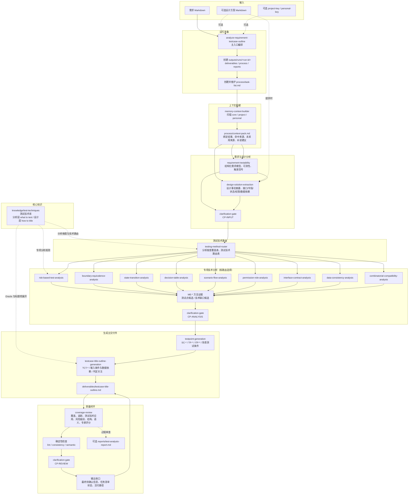

# Testcase Title Outline Agent 整体架构设计

## 1. 文档目的

本文描述 Testcase Title Outline Agent 的独立系统架构、运行流程、组件职责、输出契约和质量闭环。

本 Agent 面向 Markdown 需求文档和可选设计方案文档，输出 `测试用例标题大纲`。它是独立项目，所有运行入口、知识库、模板、质量门禁和校验脚本都在本仓库内维护，不依赖其他 Agent 项目或外部仓库结构。

核心输出结构：

```text
测试场景 -> 测试点 -> 测试用例标题项
```

`测试用例标题项` 是标题级设计产物，包含测试用例标题、覆盖意图、级别、输入条件与数据依赖、判定关注和待确认信息。它不是完整测试用例，不包含前置步骤、测试步骤、完整预期结果或自动化脚本。

## 2. 设计目标与边界

### 2.1 目标

- 输入一份 Markdown 需求文档，并可选输入一份或多份设计方案 Markdown 文档。
- 从需求中识别业务场景、角色、规则、流程、状态、接口、数据和风险。
- 从设计方案中提取接口、字段、状态机、权限、数据依赖、配置开关、异常处理、非功能指标和设计缺口。
- 使用内置测试技术，把需求和设计方案转换成场景化测试点，并把测试点展开为标题项。
- 将每个测试点扩展成 1-N 个测试用例标题项。
- 输出自包含主交付件，不要求后续标题项评审、细化或落地回读原始需求、设计方案、过程报告或 memory。
- 通过质量门禁和确定性 lint 检查标题大纲结构、粒度和非完整用例化约束。

### 2.2 非目标

- 不生成完整测试用例。
- 不生成前置步骤、测试步骤或完整预期结果。
- 不生成自动化脚本。
- 不编造需求或设计方案没有提供的业务规则、接口、字段、状态、错误码、阈值或测试数据。
- 不依赖其他 Agent 项目的 skill、knowledge、template、quality gate 或脚本。

## 3. 架构原则

| 原则 | 说明 |
|---|---|
| 独立内聚 | 主入口、知识、模板、门禁、脚本和示例都在本仓库内闭环维护 |
| 标题粒度可控 | 标题项只写标题、输入条件与数据依赖、判定关注，不写步骤和完整预期 |
| 需求与设计并重 | 需求提供业务规则和验收范围，设计方案提供接口、字段、状态、数据依赖和实现约束 |
| 方法可追溯 | 测试技术在分析层和标题级设计层的应用通过过程报告或审查记录可追踪，主交付件保持清爽 |
| 自包含交付 | 后续标题项评审、细化或落地只读取主交付件即可继续工作 |
| 待确认后置 | 缺失信息进入待确认信息，不中途打断用户 |
| 平台无关 | Claude Code、OpenCode 或其他运行环境只是载体，核心逻辑沉淀在 Markdown 和轻量 Python 脚本中 |

## 4. 目录结构

```text
PROJECT_ROOT/
├── .claude-plugin/
├── .opencode/
│   ├── commands/
│   │   └── analyze-requirement-testcase-outline.md
│   └── skills/
├── AGENTS.md
├── CLAUDE.md
├── skills/
│   ├── analyze-requirement-testcase-outline/
│   ├── requirement-testability/
│   ├── design-solution-extraction/
│   ├── testing-method-router/
│   ├── risk-based-test-analysis/
│   ├── boundary-equivalence-analysis/
│   ├── state-transition-analysis/
│   ├── decision-table-analysis/
│   ├── scenario-flow-analysis/
│   ├── permission-role-analysis/
│   ├── interface-contract-analysis/
│   ├── data-consistency-analysis/
│   ├── combinatorial-compatibility-analysis/
│   ├── testpoint-generation/
│   ├── testcase-title-outline-generation/
│   ├── clarification-gate/
│   ├── memory-context-builder/
│   └── coverage-review/
├── knowledge/
│   ├── basic-test-types.md
│   ├── testpoint-standard.md
│   ├── test-analysis-methodology.md
│   ├── test-method-routing-matrix.md
│   ├── method-evidence-standard.md
│   ├── testcase-title-outline-standard.md
│   ├── test-techniques/
│   ├── projects/
│   ├── user/
│   └── ...
├── templates/
│   ├── testcase-title-outline-template.md
│   ├── final-report-template.md
│   └── ...
├── quality-gates/
│   ├── testcase-title-outline-check.md
│   └── ...
├── bin/
│   ├── lint-testcase-title-outline.py
│   ├── sync-opencode-skills.py
│   └── validate-agent-runtime.py
└── outputs/
    └── runs/
```

## 5. 主运行流程

主流程从需求和可选设计方案输入开始，经过上下文构建、需求建模、设计事实提取、待确认治理、测试技术路由、专项分析、测试点生成、标题项生成和质量验收，最终输出测试用例标题大纲。

测试技术库 `knowledge/test-techniques/` 同时服务两层：测试分析层用它回答 `what to test`，识别测试条件、覆盖项、风险和测试点候选；标题级测试设计层用它回答 `how to title`，把测试点展开为标题项、输入条件与数据依赖和判定关注。



流程分阶段说明：

| 阶段 | 输入 | 核心处理 | 输出 |
|---|---|---|---|
| 准备与上下文 | 需求文档、可选设计方案、project/personal 配置 | 固定项目根目录，创建运行目录，构建 context-pack | `process/context-pack.md` |
| 需求可测性分析 | context-pack、需求文档 | 提取业务规则、角色、流程、状态、接口依赖、分析维度和方法触发信号 | 结构化需求模型、需求待确认候选 |
| 设计事实提取 | 设计方案文档、结构化需求模型、context-pack | 提取接口、字段、状态、权限、数据依赖、配置、异常处理、非功能约束和设计缺口 | 设计方案事实摘要、设计缺口候选 |
| 待确认治理 | 各阶段候选问题 | 在固定检查点去重、分级、排序和降级，不中途打断用户 | 最终待确认候选和过程治理记录 |
| 方法分析与测试点生成 | 结构化需求和设计事实、测试技术库 | 路由测试技术，生成方法证据，归并场景化测试点 | 场景、场景测试条件、`TP-*` 和 `ITP-*` |
| 标题大纲生成与验收 | 场景化测试点、测试技术库 | 生成测试用例标题项，执行覆盖审查、质量门禁和 lint | `deliverables/testcase-title-outline.md` |

## 6. 输入与输出

### 6.1 输入

- 必需：需求 Markdown 文档。
- 可选：设计方案 Markdown 文档。
- 可选：`project-key` 和 `personal-key`，用于 project/personal 上下文发现。

设计方案的主要用途是补充需求没有详细展开的实现约束，例如接口契约、字段、状态、权限、数据依赖、异常处理、配置开关和性能指标。

### 6.2 主输出

固定路径：

```text
${PROJECT_ROOT}/outputs/runs/<run-id>/deliverables/testcase-title-outline.md
```

主输出章节：

```markdown
# <需求名称> 测试用例标题大纲

## 1. 需求与设计方案信息
## 2. 测试场景清单
## 3. 测试场景详情
## 4. 接口测试标题大纲
## 5. 待确认信息
## 6. 完整性自检
```

测试点下的标题项表：

| 标题项 ID | 测试用例标题 | 覆盖意图 | 级别 | 输入条件与数据依赖 | 判定关注 | 待确认信息 |
|---|---|---|---|---|---|---|
| TCT-001 | 验证下发订单 ID 总长度为 13 位时订单下发成功 | 边界/格式 | Level 1 | 订单 ID 字段；总长度 13 位；订单下发接口可用 | 接口响应、订单下发记录、错误码 | 无 |

## 7. Knowledge 设计

Knowledge 是本项目内置的稳定测试知识，按 core、project 和 personal 分层维护：

| 层级 | 内容 | 主流程读取 |
|---|---|---|
| 方法论层 | 稳定术语、测试分析方法论、场景/测试点/标题项边界 | 是 |
| 标准层 | 测试点标准、标题大纲标准、测试类型分类 | 是 |
| 路由与证据层 | 测试技术路由矩阵、方法证据标准 | 是 |
| 测试技术层 | `knowledge/test-techniques/`，同时支撑测试分析和标题级测试设计 | 是 |
| project/personal 层 | 项目风险画像、术语、覆盖策略、个人关注点 | 按需 |

所有 core 知识文件均为本项目自有维护内容。覆盖检查、专家评分和追踪检查归属 `quality-gates/`。project/personal 层只能补充风险画像、术语、覆盖策略、个人关注点或本地门禁，不得覆盖 core 标准。完整测试用例写作知识不在本 Agent 内维护。

## 8. Skill 设计

详细优化分析见 `docs/skills-architecture-optimization-analysis.md`。本节只列出当前运行所需的 skill 分层。

主入口：

- `analyze-requirement-testcase-outline`

需求与设计分析：

- `memory-context-builder`
- `requirement-testability`
- `design-solution-extraction`
- `clarification-gate`
- `testing-method-router`

专项测试分析：

- `risk-based-test-analysis`
- `boundary-equivalence-analysis`
- `state-transition-analysis`
- `decision-table-analysis`
- `scenario-flow-analysis`
- `permission-role-analysis`
- `interface-contract-analysis`
- `data-consistency-analysis`
- `combinatorial-compatibility-analysis`

生成与审查：

- `testpoint-generation`
- `testcase-title-outline-generation`
- `coverage-review`

## 9. 质量门禁

核心门禁：

- `testcase-title-outline-check.md`
- `output-schema-check.md`
- `coverage-check.md`
- `traceability-check.md`
- `method-application-check.md`
- `risk-priority-check.md`
- `semantic-quality-check.md`

确定性校验：

```text
python bin/lint-testcase-title-outline.py outputs/runs/<run-id>/deliverables/testcase-title-outline.md
python bin/sync-opencode-skills.py --check
python bin/validate-agent-runtime.py
```

## 10. 验收标准

- 输入需求文档和可选设计方案后，能生成 `testcase-title-outline.md`。
- 主输出按 `测试场景 -> 测试点 -> 测试用例标题项` 组织。
- 每个标题项包含标题、覆盖意图、级别、输入条件与数据依赖、判定关注和待确认信息。
- 标题项不包含前置步骤、测试步骤、完整预期结果或自动化脚本。
- 设计方案中的接口、字段、状态、权限、数据依赖和配置约束能进入场景条件、标题项输入条件或待确认信息。
- 缺失信息不阻断流程，不编造事实，统一进入待确认信息。
- 示例输出能通过 `bin/lint-testcase-title-outline.py`。
- Runtime wiring 能通过 `bin/validate-agent-runtime.py`。
